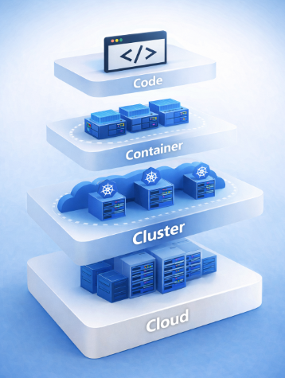
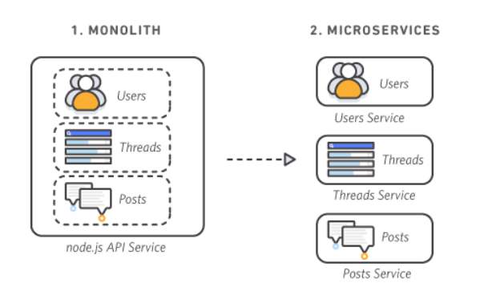
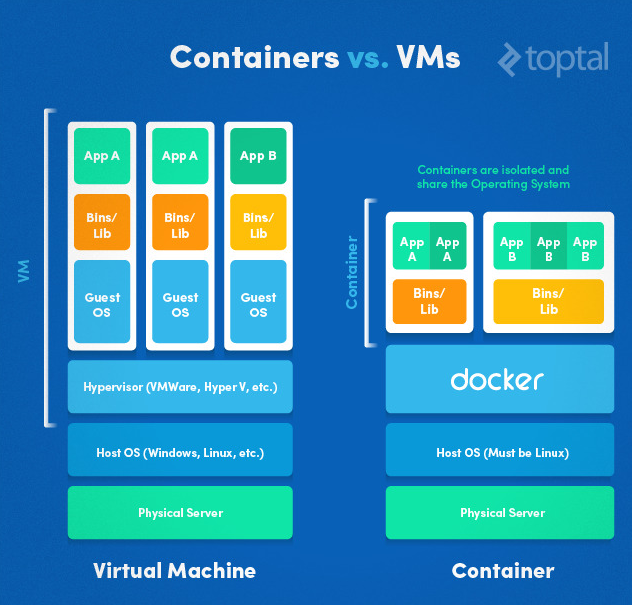
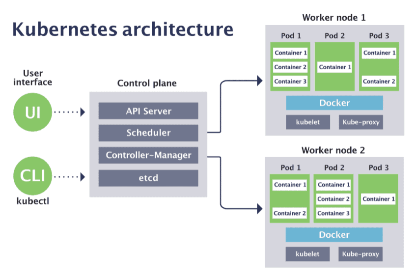

# 클라우드 네이티브 개요

## 목차  

1. 클라우드 네이티브 개요  
   1.1 클라우드 네이티브 4C 계층 구조  
   1.2 클라우드 서비스 모델 (IaaS / CaaS / PaaS)  
   1.3 클라우드 네이티브 장점  

2. 마이크로서비스 아키텍처  
   2.1 마이크로서비스 아키텍처  

3. 컨테이너 기술  
   3.1 VM vs 컨테이너  
   3.2 컨테이너 이미지 & 레이어 구조  
   3.3 컨테이너 격리 기술 (Namespace & cgroup)  

4. Kubernetes 아키텍처  
   4.1 Control Plane (마스터 노드)  
   4.2 Worker Node & Workload  

5. 클라우드 네이티브 보안의 중요성  

6. 출처  

 

## 클라우드 네이티브

### 클라우드 네이티브 4C 계층 구조 

  

- #### Cloud (클라우드)  
  클라우드 계층은 전체 시스템의 기반이 되는 인프라 영역으로, 컴퓨팅 자원(서버), 네트워크(VPC), 스토리지(S3 등), IAM과 같은 리소스를 포함합니다.  
  모든 하위 계층(Cluster, Container, Code)은 이 클라우드 환경 위에서 동작하며, 잘못된 설정 하나로 전체 시스템이 위험해질 수 있는 영역입니다.  

  - 주요 구성 요소: Compute(EC2), Storage(S3), Network(VPC), IAM  
  - 보안 포인트: 최소 권한 IAM, 퍼블릭 접근 차단, 네트워크 격리, 로깅/모니터링(CloudTrail)  
  - 대표 예시: AWS, Azure, GCP  

 

- #### Cluster (클러스터)  
  클러스터 계층은 컨테이너를 실행하고 관리하는 오케스트레이션 영역으로, 주로 Kubernetes가 사용됩니다.  
  여러 노드(Node) 위에서 컨테이너를 스케줄링하고, 서비스 간 통신과 확장, 장애 복구를 담당합니다.  

  - 주요 구성 요소: Kubernetes, Node, Control Plane, Scheduler  
  - 보안 포인트: RBAC 최소 권한, Pod Security Standard, Network Policy, Admission Controller  
  - 대표 예시: Kubernetes, OpenShift  

 

- #### Container (컨테이너)  
  컨테이너 계층은 애플리케이션 실행 환경을 패키징한 단위로, 코드와 실행 환경을 함께 포함합니다.  
  컨테이너를 통해 개발/운영 환경의 일관성을 유지할 수 있으며, 빠른 배포와 확장이 가능합니다.  

  - 주요 구성 요소: Container Image, Runtime (Docker, containerd)  
  - 보안 포인트: 이미지 취약점 스캔, 최소 베이스 이미지 사용, non-root 실행, 불필요한 패키지 제거  
  - 대표 예시: Docker, containerd  

 

- #### Code (코드)  
  코드 계층은 실제 비즈니스 로직이 구현된 애플리케이션 영역입니다.  
  사용자 입력을 처리하고, 인증/인가를 수행하며, 데이터 처리 로직이 포함되는 가장 직접적인 공격 대상입니다.  

  - 주요 구성 요소: 애플리케이션 코드, 라이브러리, API  
  - 보안 포인트: 입력값 검증, 인증/인가 처리, 시크릿 관리, 취약한 라이브러리 제거  
  - 대표 예시: Aws Lambda

 

### 클라우드 서비스 모델 (IaaS / PaaS / CaaS)

클라우드 환경은 제공되는 서비스 수준에 따라 IaaS, PaaS, CaaS로 구분되며,  
각 모델은 사용자가 직접 관리해야 하는 범위와 클라우드 제공자가 책임지는 영역이 다릅니다.  

- #### IaaS (Infrastructure as a Service)  
  IaaS는 서버, 스토리지, 네트워크와 같은 인프라 자원을 클라우드에서 제공하는 모델로, 사용자는 운영체제(OS)부터 애플리케이션까지 직접 구성하고 관리합니다.  
  가장 기본적인 형태의 클라우드 서비스로, 높은 자유도와 유연성을 제공하지만 그만큼 관리 부담도 큰 편입니다.  

  - 관리 범위: OS, 미들웨어, 런타임, 애플리케이션 직접 관리  
  - 특징: 높은 제어권, 커스터마이징 가능, 인프라 중심 운영  
  - 대표 예시: AWS EC2, Azure VM, Google Compute Engine  
 

- #### CaaS (Container as a Service)  
  CaaS는 컨테이너 기반 애플리케이션을 실행하고 관리할 수 있는 플랫폼을 제공하는 모델로, Kubernetes와 같은 오케스트레이션 환경을 클라우드에서 사용할 수 있게 해줍니다.  
  컨테이너 단위의 배포와 확장이 가능하며, 클라우드 네이티브 아키텍처에서 핵심적인 역할을 합니다.  

  - 관리 범위: 컨테이너 및 애플리케이션 관리 (인프라는 클라우드가 담당)  
  - 특징: 컨테이너 중심 운영, 확장성과 유연성, DevSecOps와 높은 적합성  
  - 대표 예시: AWS EKS, Google GKE, Azure AKS  
 

- #### PaaS (Platform as a Service)  
  PaaS는 애플리케이션 실행을 위한 플랫폼(런타임, 미들웨어, OS 등)을 클라우드에서 제공하는 모델로, 사용자는 코드 작성과 배포에 집중할 수 있습니다.  
  인프라 관리 부담이 줄어들어 개발 생산성이 높아지지만, 플랫폼에 대한 의존성이 증가할 수 있습니다.  

  - 관리 범위: 애플리케이션 및 일부 설정만 관리  
  - 특징: 빠른 개발 및 배포, 인프라 관리 최소화, 생산성 향상  
  - 대표 예시: AWS Elastic Beanstalk, Google App Engine, Azure App Service  

 

### 클라우드 네이티브 장점

클라우드 네이티브는 컨테이너, 마이크로서비스, DevOps, CI/CD와 같은 기술과 운영 방식을 기반으로 구성됩니다. 따라서 서비스를 빠르게 개발하고 안정적으로 운영하기 위한 특성을 제공합니다.  

- #### 민첩성 (Agility)  
  마이크로서비스 구조를 기반으로 기능 단위의 독립적인 개발과 배포가 가능하여, 서비스 변경 사항을 빠르게 반영할 수 있으며 CI/CD 파이프라인과 결합하여 지속적인 개선과 배포가 이루어집니다.  

- #### 확장성 (Scalability)  
  트래픽 증가나 서비스 부하에 따라 컨테이너 및 인프라 자원을 자동으로 확장하거나 축소할 수 있으며, Kubernetes HPA 및 클라우드 Auto Scaling 기능을 통해 효율적인 리소스 운영이 가능합니다.  

- #### 회복 탄력성 (Resilience)  
  서비스 장애 발생 시 컨테이너가 자동으로 재시작되거나 다른 노드로 재배치되며, 분산된 구조를 통해 단일 장애 지점(SPOF)을 최소화하여 안정적인 서비스 운영을 지원합니다.  

- #### 비용 효용성 (Cost Efficiency)  
  컨테이너 기반 경량화로 기존 VM 대비 높은 자원 활용도를 제공하며, 온디맨드 방식으로 필요한 만큼만 리소스를 사용함으로써 비용 절감과 효율적인 운영이 가능합니다.  

- #### 자동화 및 일관성 (Automation & Consistency)  
  Infrastructure as Code(IaC)와 CI/CD를 통해 인프라 구축, 배포, 확장, 복구 등의 과정을 자동화하고, 컨테이너 기반 실행 환경을 통해 개발·테스트·운영 환경 간의 일관성을 유지할 수 있습니다.  

 

### 마이크로서비스 아키텍처

  
출처: AWS 모놀리식 아키텍처 vs 마이크로서비스 아키텍처 비교

마이크로서비스 아키텍처(MSA)는 하나의 애플리케이션을 여러 개의 독립적인 서비스로 분리하여 구성하는 구조로, 각 서비스는 특정 기능에 집중하며 독립적으로 개발, 배포, 확장이 가능합니다.  

기존 모놀리식(Monolith) 구조에서는 Users, Threads, Posts와 같은 기능이 하나의 애플리케이션에 포함되어 있어 하나의 변경이 전체 서비스에 영향을 줄 수 있지만, 마이크로서비스 구조에서는 각 기능이 별도의 서비스로 분리되어 서로 독립적으로 동작합니다.  

이러한 구조적 접근은 서비스 간 결합도를 낮추어 특정 기능의 장애가 전체 시스템으로 확산되는 것을 방지합니다. 또한 자동화된 환경을 통해 운영 효율성을 극대화하며, 개발 속도와 민첩성을 확보함으로써 비즈니스 요구사항에 빠르게 대응할 수 있는 강력한 기반을 제공합니다.  

- #### 주요 특징  
  - 기능 단위로 서비스 분리 (Users, Posts 등)  
  - 서비스별 독립 배포 및 확장 가능  
  - 장애 격리 및 부분 장애 허용 구조  
  - API 기반 통신 (REST, gRPC 등)  

- #### 장점  
  - 변경 영향 범위 최소화 → 빠른 배포 가능  
  - 서비스별 스케일링 → 자원 효율성 증가  
  - 팀 단위 개발 가능 → 생산성 향상  

- #### 단점  
  - 서비스 간 통신 복잡도 증가  
  - 데이터 일관성 관리 어려움  
  - 모니터링 및 운영 난이도 증가  

 

## 컨테이너 기술

컨테이너 기술은 애플리케이션과 실행에 필요한 환경을 하나의 단위로 패키징하여, 어떤 환경에서도 동일하게 실행될 수 있도록 하는 기술입니다.  
OS 커널을 공유하면서 프로세스 단위로 격리되기 때문에 가볍고 빠르며, 클라우드 네이티브 환경의 실행 단위로 사용됩니다.  

### VM vs 컨테이너  

  

출처: https://hwanine.github.io/web/Container-vs-VM/
https://hazel-developer.tistory.com/242

- #### VM (Virtual Machine)  
  VM은 하이퍼바이저 위에서 동작하며, 각각의 VM이 독립적인 Guest OS를 포함합니다.  
  이로 인해 강한 격리성을 제공하지만, OS까지 포함되기 때문에 무겁고 부팅 속도가 느립니다.  

- #### 컨테이너 (Container)  
  컨테이너는 Host OS의 커널을 공유하며, 프로세스 단위로 격리됩니다.  
  별도의 OS를 포함하지 않기 때문에 가볍고 빠르게 실행되며, 높은 자원 효율성을 제공합니다.  

 

### 컨테이너 이미지 & 레이어 구조

컨테이너는 이미지(Image)를 기반으로 실행됩니다.  

- #### 컨테이너 이미지  
  애플리케이션 실행에 필요한 코드, 라이브러리, 설정이 포함된 불변(immutable) 템플릿입니다.  
  이미지는 실행되면 컨테이너가 됩니다.  

- #### 레이어 구조 (Layered Architecture)  
  Docker 이미지는 여러 개의 읽기 전용 레이어로 구성됩니다.  

  - 각 명령어(Dockerfile 기준)가 하나의 레이어 생성  
  - 변경된 부분만 새로운 레이어로 추가  
  - 기존 레이어 재사용 → 빌드 속도 향상  

 

### 컨테이너 격리의 기술 (Namespace & cgroup)  

컨테이너는 단순한 패키징 기술이 아니라, Linux 커널 기능을 기반으로 한 격리 기술입니다.  
그 중심에는 namespace와 cgroup이 있습니다.  

- #### Namespace (네임스페이스)  
  프로세스가 시스템 자원을 "독립된 공간"처럼 보이도록 만들어주는 기능입니다.  
  하나의 시스템 위에서 여러 컨테이너가 서로를 보지 못하도록 격리합니다.  

- #### cgroup (Control Group)  
  프로세스가 사용할 수 있는 자원의 양을 제한하고 관리하는 기능입니다.  

 

## Kubernates 아키텍처

  
출처: https://www.cncf.io/blog/2019/08/19/how-kubernetes-works/  

Kubernetes는 컨테이너화된 애플리케이션을 자동으로 배포, 확장, 운영하기 위한 오케스트레이션 플랫폼으로, 전체 구조는 크게 Control Plane(마스터 노드)과 Worker Node(실행 노드)로 구성됩니다.  

 

### Control Plane (마스터 노드)

Control Plane은 클러스터 전체를 관리하고, 원하는 상태를 유지하도록 제어하는 역할을 수행합니다.  

- #### API Server  
  Kubernetes의 핵심 진입점으로, 모든 요청(UI, CLI, kubectl)은 API Server를 통해 처리됩니다.  
  클러스터의 상태를 조회하거나 변경하는 모든 작업이 이 컴포넌트를 중심으로 이루어집니다.  

- #### etcd  
  클러스터의 모든 상태 정보를 저장하는 Key-Value 저장소입니다.  
  Pod 상태, 설정 정보, 네트워크 정보 등을 저장하며 백업 및 암호화가 필수입니다.

- #### Scheduler  
  새롭게 생성된 Pod를 어떤 Worker Node에 배치할지 결정합니다.  
  노드의 자원 상태(CPU, 메모리 등)와 정책을 고려하여 최적의 위치에 할당합니다.  

- #### Controller Manager  
  클러스터의 현재 상태를 지속적으로 감시하고, 원하는 상태와 다를 경우 이를 자동으로 조정합니다.  

 

### Worker Node & Workload

Worker Node는 실제로 컨테이너가 실행되는 영역이며, 사용자가 정의한 워크로드가 배치됩니다.  

- #### Worker Node 구성 요소  
  - **kubelet**  
    각 노드에서 실행되며, Control Plane의 지시를 받아 컨테이너를 실행하고 상태를 보고합니다.  
  - **kube-proxy**  
    서비스 네트워크를 구성하고, Pod 간 통신을 가능하게 합니다.  
  - **Container Runtime**  
    실제 컨테이너를 실행하는 엔진 (Docker, containerd 등)  

- #### Pod (기본 실행 단위)  
  Kubernetes에서 컨테이너를 실행하는 최소 단위입니다.  
  하나의 Pod에는 하나 이상의 컨테이너가 포함될 수 있으며, 동일한 네트워크와 스토리지를 공유합니다.  

- #### Workload (배포 단위)  
  Pod를 직접 관리하지 않고, Deployment, StatefulSet과 같은 리소스를 통해 관리합니다.  
  - Deployment: 일반적인 stateless 서비스  
  - StatefulSet: 상태를 가지는 서비스 (DB 등)  

- #### Service & API  
  Kubernetes는 Service를 통해 Pod에 안정적인 접근 경로를 제공하며,  
  모든 리소스는 Kubernetes API를 통해 선언적으로 관리됩니다.  

 

## 클라우드 네이티브 보안의 중요성

클라우드 네이티브 환경은 컨테이너, Kubernetes, 마이크로서비스, CI/CD 등 다양한 기술이 결합된 구조로, 기존 모놀리식 환경보다 훨씬 높은 유연성과 확장성을 제공하는 동시에 공격 표면(Attack Surface)도 크게 증가하게 됩니다.   
따라서 보안을 전체 아키텍처를 포함할 수 있도록 신중히 고려되어야 합니다.  

- #### 공격 표면 증가  
  마이크로서비스 구조로 인해 서비스 수가 증가하고, 서비스 간 API 통신이 많아지면서  
  인증/인가, API 보안, 서비스 간 신뢰 문제가 새로운 공격 지점으로 확대됩니다.  

- #### 동적 환경 (Dynamic Infrastructure)  
  컨테이너와 Pod는 생성과 삭제가 반복되는 일시적인(Ephemeral) 특성을 가지기 때문에,  
  전통적인 방식의 보안(정적 IP, 고정 서버 기반 접근 제어)으로는 대응이 어렵습니다.  

- #### 구성 오류 (Misconfiguration) 위험  
  Kubernetes, IAM, 네트워크 정책 등 다양한 설정 요소가 존재하며,  
  잘못된 설정 하나로도 전체 시스템이 외부에 노출될 수 있습니다.  
  (예: 과도한 IAM 권한, 공개된 S3, 잘못된 RBAC 설정)  

- #### 공급망 보안 (Supply Chain Security)  
  컨테이너 이미지는 외부 레지스트리(Docker Hub 등)를 통해 가져오는 경우가 많기 때문에,  
  취약하거나 악성 코드가 포함된 이미지가 그대로 배포될 위험이 존재합니다.  

- #### DevSecOps의 필요성  
  이러한 환경에서는 보안을 사후에 점검하는 방식이 아니라,  
  개발 단계부터 배포까지 보안을 통합하는 DevSecOps 접근이 필수적입니다.  
  (SAST, DAST, SCA를 CI/CD에 통합)  

 
 

## 출처
- https://kubernetes.io/ko/docs/concepts/security/overview/
- https://aws.amazon.com/ko/microservices/?trk=83b1abef-f25e-4840-9a5e-aa5481830155&sc_channel=ps&ef_id=CjwKCAjw4ufOBhBkEiwAfuC7-d6A0wMAJ5fPZTVQWXe0rkmojsPcT4UMnVoGyuaOjucvtk6SOgwMwRoC1DMQAvD_BwE:G:s&s_kwcid=AL!4422!3!795924654854!p!!g!!microservices%20architecture!23533254916!192628939173&gad_campaignid=23533254916&gbraid=0AAAAADjHtp_EbTnwTJ4BGtcMsx0JUI94e&gclid=CjwKCAjw4ufOBhBkEiwAfuC7-d6A0wMAJ5fPZTVQWXe0rkmojsPcT4UMnVoGyuaOjucvtk6SOgwMwRoC1DMQAvD_BwE
- https://cloud.google.com/learn/what-is-microservices-architecture?hl=ko
- https://www.netapp.com/ko/blog/containers-vs-vms/
- https://hwanine.github.io/web/Container-vs-VM/
- https://hazel-developer.tistory.com/242
- https://www.cncf.io/blog/2019/08/19/how-kubernetes-works/