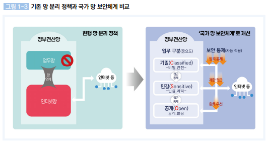
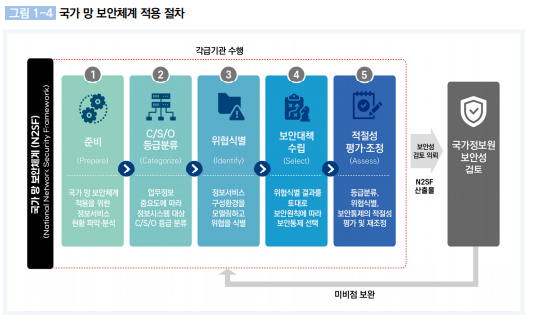
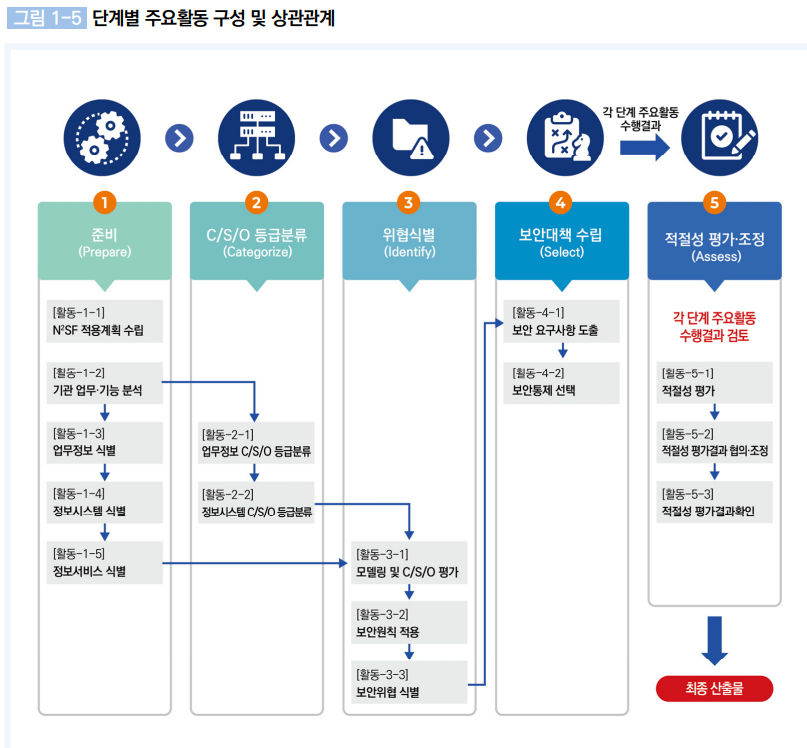
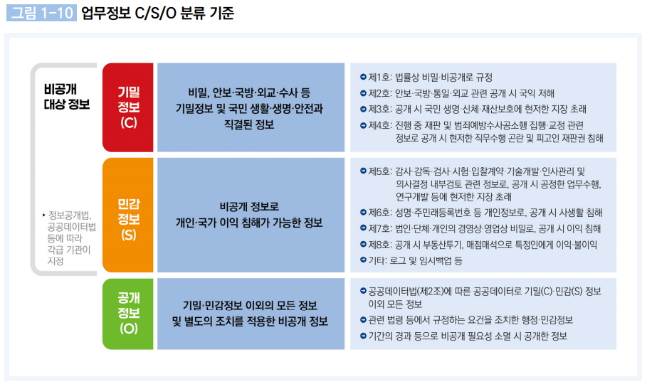
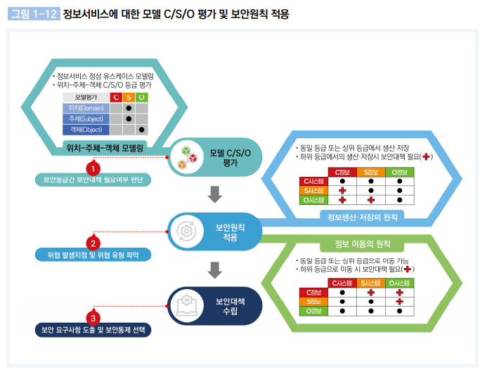
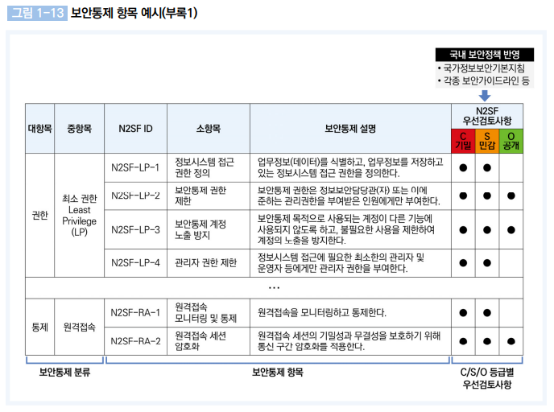

# N2SF 개요 및 적용절차, 보안통제 체계

## 목차

1. N2SF 등장 배경  
   1.1 기존 망 분리 정책의 한계  
   1.2 국가 망 보안체계 (N2SF) 개요  

2. 국가 망 보안체계 (N2SF) 핵심 개념  
   2.1 적용 절차  
   2.2 단계별 주요 활동 및 상호 관계  
   2.3 C/S/O 등급 분류 기준  
   2.4 정보서비스 모델링 및 보안원칙  

3. N2SF 보안통제 체계  
   3.1 보안통제 항목 예시  
   3.2 보안통제 항목 구성  

4. 정보서비스 모델 11종 (참고)

 

## N2SF 등장 배경

### 기존 망 분리 정책의 한계   

기존의 망 분리 정책은 외부의 위협을 물리적으로 차단하여 보안성을 높였습니다.  

하지만 클라우드 서비스와 AI 기반 업무 활용이 급격히 증가하면서, 내부망 중심의 폐쇄적인 구조만으로는 실제 업무 요구를 충족하기 어려워졌습니다.

특히,  
- SaaS와 클라우드 인프라 활용 증가로 인해 외부 네트워크 접근이 필수 요소가 되었고, 
- 생성형 AI 및 외부 API 사용 확대로 데이터의 외부 전송과 연계 처리가 빈번해졌습니다. 
- 이에 따라 업무 수행을 위해 망 분리 예외 정책이 지속적으로 확대되는 문제가 발생했습니다.

또한, 이러한 환경에서는
- 자료 반출을 위한 USB, 이메일, 중계 서버 등의 우회 경로가 증가하고,
- 재택근무 및 협업 환경에서는 망 분리가 생산성을 저해하는 요소로 작용하게 됩니다.

결과적으로, 증가하는 클라우드, AI 활용 요구와 망 분리 정책 간의 구조적 충돌로 인해,
기존의 망 분리 정책은 보안성과 운영 효율성을 동시에 저해하는 한계를 드러내고 있습니다. 

 

### 국가 망 보안 체계 (N2SF)

  

- #### 현행 망 분리 정책 (좌측)

기존 구조는 정부전산망 내부에서 업무망과 인터넷망을 분리하여 운영하는 방식입니다.
두 망은 직접 연결되지 않으며, 데이터 이동이 필요할 경우 중계 서버나 승인 절차를 통해 제한적으로만 가능했습니다.

이 방식은 내부망을 신뢰하고 외부를 차단하는 경계 기반 보안 모델로, 단순하고 명확한 구조를 가지지만, 실제 업무에서는 인터넷 연계가 필요할 때 우회 경로가 발생하고 운영 효율성이 떨어지는 문제가 있습니다.  

- #### 국가망 보안체계 개선 (우측)

개선된 구조는 망이 아닌 데이터와 업무의 중요도를 기준으로 보안을 적용합니다.
업무를 기밀(Classified), 민감(Sensitive), 공개(Open)로 구분하고, 각 등급에 따라 다른 수준의 보안 통제를 적용합니다.

데이터가 이동할 때는 반드시 보안 통제지점을 거치며, 이 과정에서 인증, 접근 제어, 정책 검증이 수행됩니다.
인터넷 연결 또한 일괄 차단이 아니라 데이터 등급에 따라 선택적으로 허용됩니다.

 
 

## 국가 망 보안 체계 (N2SF) 핵심 개념  

### 국가 망 보안체계 (N2SF) 적용 절차 

  
 

국가 망 보안체계는 준비부터 평가까지 5단계 절차로 구성되어, 기관이 자율적으로 보안 수준을 설계할 수 있도록 합니다. 최종 산출물은 국정원 보안성 검토 시 제출하게 됩니다.  

자산 분류 → 위협 분석 → 보안 적용 및 검증 구조를 활용하여 체계적인 위험 관리 절차를 수행합니다.  

 

### 단계별 주요 활동 및 상호 관계  

  

각 단계는 순차적으로 수행되며, 자산 분류 결과를 기반으로 위협을 식별하고, 식별된 위협에 따라 보안통제를 적용하는 흐름으로 구성됩니다.  

이 과정은 최종적으로 적정성 평가를 통해 검증되며,  
전체 절차가 유기적으로 연결된 위험 기반 보안 관리 구조를 형성합니다.  

 

### 업무정보 및 정보시스템 C/S/O 등급 분류 기준

  
 

C/S/O 등급 분류는 업무정보, 정보시스템, 위치를 기준으로 단계적으로 수행됩니다.

먼저 각 기관의 업무에 활용되는 업무정보를 식별하고, 이를 C(Classified), S(Sensitive), O(Open) 등급으로 분류합니다. 이후 해당 정보를 생산·저장·처리하는 정보시스템은 업무정보의 등급을 기준으로 동일하게 분류되며, 하나의 시스템에 서로 다른 등급의 정보가 혼재된 경우에는 가장 높은 등급을 기준으로 적용합니다.  

또한 정보시스템의 물리적·논리적 위치에 대해서도 등급 분류를 수행하며, 이는 위협 식별 및 보안대책 수립 과정에서 중요한 기준으로 활용됩니다. 일반적으로 인터넷 영역은 O 등급, 업무 처리 영역은 S 등급, 기밀 정보를 다루는 특수 환경은 C 등급으로 구분합니다.  

이와 같은 등급 분류 과정에서는 공개 가능한 정보가 과도하게 비공개로 분류되거나, 반대로 비공개 정보가 공개로 분류되지 않도록 주의가 필요합니다. 특히 하나의 시스템에 다양한 등급의 정보가 포함될 경우, 높은 등급 기준이 적용되어 불필요한 보안 제약이 발생할 수 있으므로, 동일 등급별로 시스템을 분리·운영하는 것이 권장됩니다.  

한편, 업무정보의 등급 분류 기준은 「정보공개법」, 「공공데이터법」, 「보안업무규정」 등 관련 법령에 근거합니다. 기밀정보(C)는 안보·국방·외교·수사 등 국가 핵심 기능과 직결되거나 국민의 생명·안전에 영향을 미치는 정보로서 비공개 대상 정보에 해당합니다. 민감정보(S)는 공개 시 개인 또는 국가의 이익 침해가 우려되는 정보로, 개인정보, 내부 업무자료, 시스템 로그 등 다양한 비공개 정보가 포함됩니다. 공개정보(O)는 기밀 및 민감정보를 제외한 모든 정보로, 법령상 공개 요건을 충족하거나 시간이 경과하여 비공개 필요성이 해소된 정보도 포함됩니다.  

 

### 발생 가능한 위협을 식별하기 위한 전용 모델링 방법론 제시 

  

### 정보서비스 모델 C/S/O 평가 및 보안원칙 적용

정보서비스 보안은 「정보 생산·저장」과 「정보 이동」 두 가지 원칙을 기반으로 적용됩니다.  

- #### 정보 생산·저장 원칙  

정보시스템은 자신의 보안등급과 동일하거나 낮은 등급의 정보만을 생산·저장할 수 있으며,  
더 높은 등급의 정보를 처리할 경우에는 추가적인 보안대책이 필요합니다.  

 

| 시스템 등급 | 공개(O) 데이터 | 민감(S) 데이터 | 기밀(C) 데이터 |
|------------|---------------|---------------|---------------|
| 공개(O)     | 가능          | 불가          | 불가          |
| 민감(S)     | 가능          | 가능          | 불가          |
| 기밀(C)     | 가능          | 가능          | 가능          |

 

위 원칙에 따라 시스템 등급보다 높은 수준의 정보를 저장하려는 경우에는 반드시 보안통제가 필요합니다.  
예를 들어 공개(O) 시스템에서 민감정보를 처리해야 하는 경우, 암호화, 접근통제, 저장 분리 등의 조치를 통해  
정보 유출 위험을 최소화해야 합니다. 또한 로그와 같이 민감 정보가 포함될 수 있는 경우에는  
마스킹 또는 필드 단위 암호화를 적용하여 보호할 수 있습니다.

 

- #### 정보 이동 원칙  

정보는 동일 등급 또는 더 높은 등급의 시스템으로 이동하는 것은 허용되며,  
더 낮은 등급으로 이동할 경우에는 반드시 보안대책이 필요합니다.  

 

| 출발 데이터 등급 | 공개(O) 시스템 | 민감(S) 시스템 | 기밀(C) 시스템 |
|----------------|---------------|---------------|---------------|
| 공개(O)         | 가능          | 가능          | 가능          |
| 민감(S)         | 통제 필요     | 가능          | 가능          |
| 기밀(C)         | 통제 필요     | 통제 필요     | 가능          |

 

상위 등급 정보가 하위 등급 시스템으로 이동하는 경우에는 정보 유출 위험이 증가하므로  
반드시 적절한 보안통제를 적용해야 합니다.  

예를 들어, 내부망(S)에서 인터넷망(O)으로 데이터를 전송하는 경우에는 개인정보 마스킹,  
비식별화, 승인 절차 등을 통해 민감 정보가 외부로 노출되지 않도록 해야 합니다.  
또한 기밀정보(C)를 민감 시스템(S)으로 전달하는 경우에는 데이터 축약, 암호화 전송,  
접근 권한 제한 등을 적용하여 위험을 통제할 수 있습니다.  
로그나 리포트와 같은 정보의 외부 반출 시에도 민감 정보 제거와 같은 조치가 필요합니다.

> 요약: 상위 등급 정보의 처리 또는 하위 등급으로의 이동 시에는 반드시 보안 통제가 필요합니다.

 

## N2SF 보안통제 체계  

### 보안통제 항목 예시 (참고)

  

위와 같이 C/S/O 등급에 따라 적용 가능한 보안통제 항목이 정의되며, 기관은 이를 기반으로 환경에 맞는 보안통제를 선택·적용할 수 있습니다.  

 

### 보안통제 항목 구성 (요약)

국가 망 보안체계의 보안통제 항목은 다음과 같이 영역별로 구성됩니다.

 

1. **권한 (Privilege)**  
   - 최소 권한 (Least Privilege)  
   - 신원 검증 (Identity Verification)  
   - 식별자 관리 (Identifier Management)  
   - 계정 관리 (Account Management)  

2. **인증 (Authentication)**  
   - 다중요소 인증 (MFA)  
   - 외부 인증수단  
   - 단말 인증  
   - 인증 보호  
   - 인증 정책  
   - 로그인 관리  

3. **분리 및 격리 (Segregation & Isolation)**  
   - 시스템 분리  
   - 네트워크 격리  

4. **통제 (Control)**  
   - 정보 흐름 통제  
   - 외부 경계 보호  
   - CDS  
   - 원격접속  
   - 세션 관리  
   - 무선 접속  
   - 블루투스  

5. **데이터 (Data)**  
   - 암호키 관리  
   - 암호화 적용  
   - 데이터 전송 보호  
   - 데이터 사용 통제  

6. **정보자산 (Asset)**  
   - 모바일 단말  
   - 디바이스  
   - 정보시스템 구성요소  

 

각 영역은 세부적으로 확장된 통제 항목으로 구성되며, 전체적으로 200여 개 이상의 보안통제 항목이 정의되어 있습니다.

각 통제 항목은 적용 대상, 통제 목적, 적용 방법 등을 포함하고 있어, 기관은 이를 기반으로 업무 환경에 적합한 보안통제를 선택하여 적용할 수 있습니다.

자세한 내용은 [국가사이버안보센터 보안통제 항목 해설서](https://www.ncsc.go.kr:4018/main/cop/bbs/selectBoardArticle.do?bbsId=Notification_main&nttId=218022&menuNo=010000&subMenuNo=010300&thirdMenuNo=#LINK)에서 `(부록1)보안통제_항목_해설서.pdf`에서 확인 가능합니다.    

 
 

## 정보서비스 모델 11종 (참고)

국가 망 보안체계(N2SF)는 다양한 업무 환경을 고려하여 총 11개의 정보서비스 모델을 정의하고 있으며,  
각 모델은 업무 특성과 데이터 흐름에 맞는 보안 적용 기준을 제공합니다.  

- 모델 1: 인터넷 단말 업무 활용  
- 모델 2: 업무환경에서 생성형 AI 활용  
- 모델 3: 외부 클라우드 활용 업무환경  
- 모델 4: 업무 단말의 인터넷 이용  
- 모델 5: 공공 데이터 외부 AI 융합  
- 모델 6: 연구·특정 단말 신기술 활용  
- 모델 7: 개발 환경 분리  
- 모델 8: 클라우드 기반 통합단말  
- 모델 9: 모바일 업무환경 정보 연계  
- 모델 10: 부서 업무환경 운영 체계  
- 모델 11: 정보 연계를 위한 CDS 구성  

 

각 모델은 업무 유형별 데이터 흐름과 보안 요구사항을 기반으로 설계되었으며, 기관은 자신의 업무 환경에 적합한 모델을 선택하여 보안정책을 적용할 수 있습니다.  

자세한 내용은 [국가사이버안보센터 정보서비스 모델 해설서](https://www.ncsc.go.kr:4018/main/cop/bbs/selectBoardArticle.do?bbsId=Notification_main&nttId=218022&menuNo=010000&subMenuNo=010300&thirdMenuNo=#LINK)에서 `(부록2)정보서비스 모델 해설서(11종).zip`에서 확인 가능합니다.   

 
 

## 출처 
본 문서에 포함된 모든 이미지는 다음 자료를 참고하여 작성되었습니다.  
- 국가사이버보안센터, 「국가 망 보안체계(N2SF) 보안가이드라인 1.0」  
  https://www.ncsc.go.kr:4018/main/cop/bbs/selectBoardArticle.do?bbsId=Notification_main&nttId=218022  
- (부록1) 보안통제 항목 해설서  
- (부록2) 정보서비스 모델 해설서 (11종)