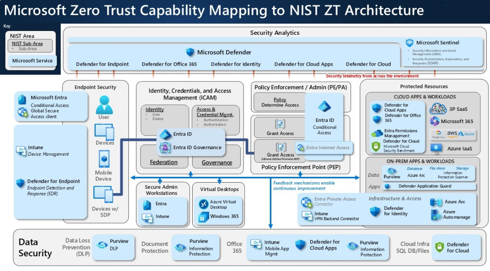
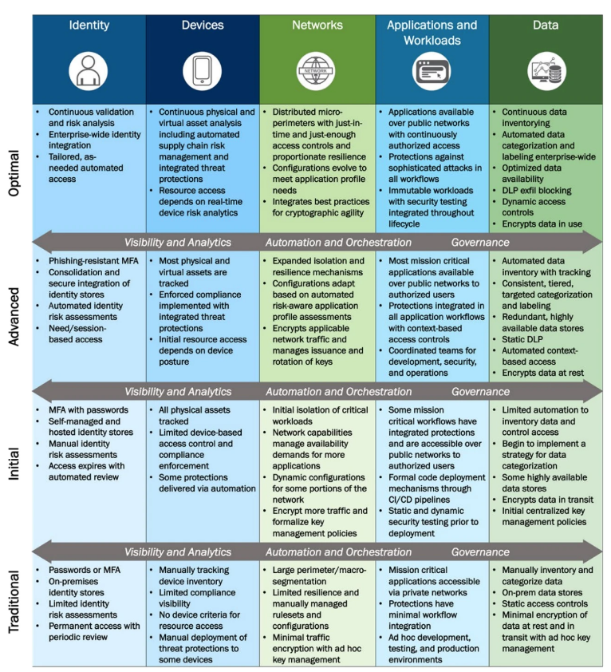
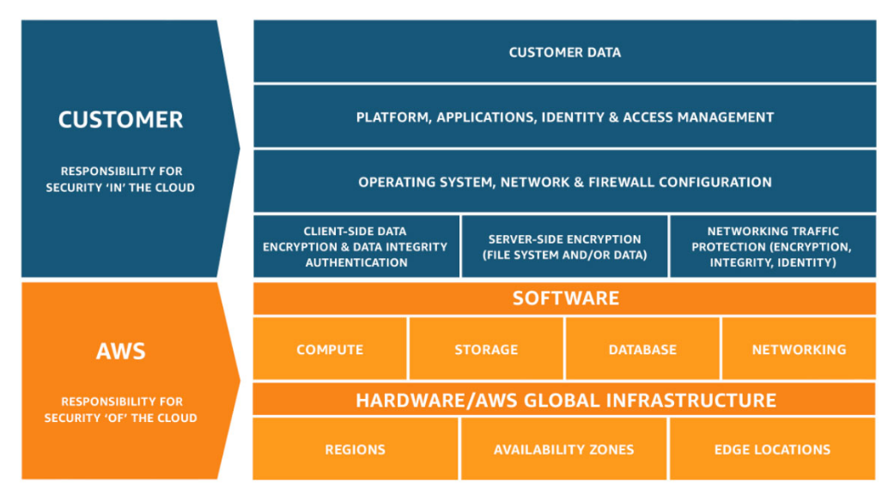
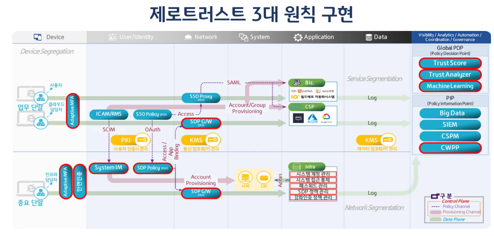

# 제로트러스트 보안 모델과 클라우드  

## 목차

1. 제로트러스트 (ZTA)  
   1.1 제로트러스트 개요  
   1.2 현대 IT 환경 변화와 새로운 보안 요구사항  
   1.3 왜 제로트러스트인가  

2. 제로트러스트 보안 모델  
   2.1 ZTA 아키텍처  
   2.2 ZTA 핵심 구성요소  
   2.3 ZTA 성숙도 모델  

3. UK NCSC 8대 ZTA 원칙  
   3.1 Know your architecture  
   3.2 Know your identities  
   3.3 Assess behaviour and device/service health  
   3.4 Use policies to authorize requests  
   3.5 Authenticate & Authorize Everywhere  
   3.6 Focus your monitoring  
   3.7 Don’t trust any network  
   3.8 Choose services designed for Zero Trust  

4. 제로트러스트 책임 모델  
   4.1 CSP 책임 영역  
   4.2 고객 책임 영역  

5. N2SF X 제로트러스트 융합 전략  
   5.1 제로트러스트 기반 통제 아키텍처  
   5.2 접근 제어 프로세스 전환  
   5.3 데이터 중심 보안 통제  

6. N2SF 고도화 방향  
   6.1 글로벌 표준 기반 보안 정합성 확보  
   6.2 데이터 중심 보호 체계 강화  
   6.3 위험 기반 보안 운영  
   6.4 컨테이너 보안 및 DevSecOps 확장  

7. 금융권 제로트러스트 적용 사례  

8. 출처

 

## 제로트러스트 (ZTA)

### 제로트러스트 개요  

제로트러스트란?

- 모든 트래픽과 요청을 신뢰하지 않고 항상 검증합니다. 
- 업무에 필요한 Least Privilege(최소권한)만 부여합니다. 
- Assume Breach(침해가정) 기반으로 방어 전략을 수립합니다. (내부망 침해 가정)
- 지속적인 상태 모니터링을 통해 실시간 위협에 대응합니다. 

퍼블릭 클라우드의 확산으로 기업의 IT 인프라는 더 이상 단일 데이터센터에 머무르지 않고, 온프레미스와 다양한 클라우드 환경이 혼합된 하이브리드 및 멀티 클라우드 구조로 빠르게 전환되고 있습니다. 이러한 환경에서는 기존처럼 명확한 네트워크 경계를 기준으로 내부와 외부를 구분하기 어려워지며, 보안 통제의 기준 또한 복잡해지고 있습니다.  

이로 인해 내부망에 위치한다는 이유만으로 신뢰를 부여하던 기존의 경계 기반 보안 모델은 점차 한계를 드러내고 있습니다. 특히 클라우드 환경에서는 사용자, 애플리케이션, API 등이 외부 네트워크를 통해 상호작용하는 구조가 일반화되면서, 내부자에 의한 위협 또한 증가하고 있습니다. 내부 계정 탈취, 권한 오남용, 과도한 권한 설정과 같은 문제는 더 이상 내부를 신뢰할 수 없는 환경을 만들고 있습니다.  

결과적으로 보안의 중심은 네트워크 경계가 아니라 신원(Identity)으로 이동하고 있습니다. 사용자가 누구인지, 어떤 권한을 가지고 있으며, 현재 어떤 행위를 수행하려는지를 지속적으로 검증하는 방식이 중요해지고 있습니다. 이러한 흐름은 최소 권한 원칙, 지속적인 인증과 인가, 그리고 Zero Trust Architecture와 같은 개념으로 이어지며, 모든 접근 요청을 기본적으로 신뢰하지 않고 검증하는 보안 모델로 발전하고 있습니다.

따라서 현대의 클라우드 환경에서는 네트워크 위치가 아닌 신원을 기반으로 한 접근 통제와 권한 관리가 핵심 보안 전략으로 자리잡고 있습니다.  

 

### 현대 IT 환경 변화와 새로운 보안 요구사항

사이버 보안 위협은 과거 단순한 외부 침입 중심에서 점차 정교하고 복합적인 형태로 진화하고 있습니다. 기존에는 방화벽과 같은 경계 기반 방어를 통해 외부 공격을 차단하는 것이 주요 전략이었지만, 최근에는 계정 탈취, 피싱, 공급망 공격, API 악용 등 정상적인 접근 경로를 활용한 공격이 증가하고 있습니다. 특히 공격자가 내부 사용자 권한을 획득한 이후에는 기존 보안 체계를 우회하여 시스템 전반으로 확산될 수 있기 때문에, 내부망 침투 시에 무방비 상태에 노출됩니다. 

이와 동시에 업무 환경 또한 크게 변화하고 있습니다. 클라우드 기술의 확산으로 온프레미스 중심의 인프라에서 벗어나 하이브리드/멀티 클라우드 환경이 확산되었으며, SaaS 서비스와 원격 근무, 모바일 기기 사용이 증가하면서 사용자와 시스템은 다양한 네트워크를 통해 연결되고 있습니다. 이로 인해 내부와 외부의 경계는 점점 모호해지고 있으며, 특정 네트워크 위치를 기준으로 신뢰를 판단하는 방식은 현실적으로 유지되기 어려운 구조로 변화하고 있습니다.

이러한 변화는 결국 보안 원칙의 근본적인 전환을 요구하고 있습니다. 과거에는 내부를 신뢰하고 외부를 차단하는 경계 기반 보안 모델이 효과적이었으나, 현재는 모든 접근을 기본적으로 신뢰하지 않고 지속적으로 검증하는 방식이 필요해졌습니다. 즉, 보안의 중심이 네트워크 위치에서 사용자와 디바이스의 신원, 그리고 행위 기반 검증으로 이동하고 있는 것입니다. 이러한 흐름 속에서 최소 권한 원칙, 지속적인 인증과 인가, 그리고 모든 요청에 대한 검증을 핵심으로 하는 새로운 보안 패러다임이 자리잡고 있습니다.  

#### 왜 제로트러스트인가? (요약 정리)  

- 사이버 위협에 진화
    - **계정 기반 공격 증가**: 피싱, 크리덴셜 스터핑 등을 통해 정상 사용자 계정을 탈취하는 공격이 증가하였습니다.
    - **내부자 및 권한 오남용 위협**: 탈취된 계정 또는 내부 사용자의 과도한 권한을 악용한 공격이 주요 위협으로 부상하였습니다.
    - **공급망 공격 확대**: 신뢰된 외부 라이브러리, 패키지, 협력사를 통한 우회 침투 공격이 증가하고 있습니다.
    - **API 및 애플리케이션 계층 공격 증가**: 네트워크가 아닌 애플리케이션/API 레벨에서의 공격이 주요 공격 벡터로 자리잡았습니다.
- 업무 환경의 변화
    - **원격근무 확산**: 재택/원격 근무 확대로 접속 위치와 단말의 다양성이 증가하였습니다. 
    - **클라우드/SaaS 확산**: 데이터가 사내망을 벗어나 외부 클라우드와 SaaS 서비스에 분산 저장됩니다. 
- 보안 원칙의 전환
    - **Perimeter-less**: 신뢰하는 내부망의 개념을 폐기합니다. 모든 네트워크를 신뢰하지 않습니다. 
    - **Verify Explicitly**: 세션 단위의 최소 권한 부여와 지속적으로 동적 정책을 재평가해야 합니다.

추가로, 현재 보안적합성을 받는 경우에는 내부망 침투를 가정하고 검증하는 방식이 일반적이라고 합니다. 외부 경계 방어만으로 충분하지 않다는 전제는 굉장히 중요한 평가 기준이 되었습니다.  

 

## 제로트러스트 보안 모델

### ZTA 아키텍처

  
출처: https://www.microsoft.com/en-us/security/blog/2024/08/06/how-microsoft-and-nist-are-collaborating-to-advance-the-zero-trust-implementation/

위 다이어그램은 NIST ZTA 기준 아키텍처 위에 마이크로소프트 솔루션을 매핑한 다이어그램입니다. 각 박스의 제목을 통해 전체적인 흐름을 참고하면 됩니다.  

사용자와 디바이스의 신원을 중심으로 접근이 결정되며, 정책 기반으로 모든 요청이 검증되고, 그 결과가 다시 분석 및 피드백으로 이어지는 순환 구조를 갖습니다.  

해당 아키텍처를 기준으로 ZTA의 핵심 구성요소를 알아봅니다. 

 

### ZTA의 핵심 구성요소

- #### PE (Policy Engine)

보안 정책을 해석하고 접근 요청에 대한 허용 여부를 최종 결정하는 역할입니다.  
신뢰도 알고리즘을 기반으로 주체의 접근 권한을 판단합니다. 

이를 통해, 접근 허용/차단 의사결정을 하게됩니다. 

- #### PA (Policy Administrator)

PE의 결정을 실행 명령을 변환하고, 인증/인가 서비스를 연계하여 세션별 토큰이나 크리덴셜을 생성하고 관리하는 역할을 수행합니다.  

명령 변환과 세션 관리에 사용됩니다. 

- #### PEP (Policy Enforcement Point)

지원 앞단에 위치하여 실제 접근을 허용하거나 차단하는 게이트웨이 역할입니다. 사용자/단말과 리소스 간의 연결, 모니터링, 종료를 수행합니다. 

물리적/논리적 접근 통제인 Gatekeeper 역할입니다. 

- #### PIP (Policy Information Point)

PE가 올바른 결정을 내릴 수 있도록 자산상태, 위협정보, 사용자 속성, 규정 등의 다양한 상황 정보를 수집하여 제공합니다. 

판단 근거 데이터를 제공합니다. 

 

### ZTA 성숙도 모델

  

출처: https://blog.securesky.com/zero-trust-maturity-model-ztmm-2.0-a-transition-to-zta

Zero Trust 성숙도 모델은 조직의 보안 수준을 단계적으로 평가하고, ZTA를 점진적으로 도입하고 고도화하기 위한 기준입니다.   
각 단계는 보안 통제 수준, 자동화 정도, 그리고 신원 기반 접근 제어의 성숙도를 기준으로 구분됩니다.

- #### Traditional
    - 경계 중심 보안 (FireWall, VPN)
    - 내부망 신뢰, 외부 차단 구조
    - 고정된 자격증명(id/pw) 사용
    - 수동 관리/대응 & 가시성 부족
- #### Initial
    - MFA(다중요소인증) 도입 시작
    - 일부 자산/디바이스 관리 시작
    - 기본적인 클라우드 보안 적용
    - 로그수집 자동화 시작
- #### Advanced
    - 신원 기반 접근 제어 정착
    - 디바이스 상태 기반 접근 판단
    - 최소 권한과 세션 기반 정책 적용
    - 통합 모니터링과 분석 체계 구축
- #### Optimal
    - 지속적 검증 (Continuous Verification)
    - 위험 기반 동적 접근 제어 (Risk-based Access)
    - 정책 자동화 및 오케스트레이션
    - 데이터 중심 보호 및 전 영역 통합 

 

## UK NCSC 8대 ZTA 원칙

### 1. Know your architecture
- 사용자, 디바이스, 서비스, 데이터 등 전체 구성 요소와 상호 연결 관계를 명확히 파악하고 문서화 합니다. 
- 관리되지 않는 레거시 시스템과 섀도우 IT 자산을 식별해서 보안 사각지대를 제거하고 전체 공격 표면을 이해합니다. 
- 하드웨어, 소프트웨어, 데이터 자산에 대한 최신 인벤토리를 유지하고, 각 자산의 중요도와 소유자를 명확히 정의하여 관리합니다. 
 

### 2. Know your identities
- 네트워크에 접근하는 모든 주체에 대해 유일한 식별자를 부여해야합니다. 
    - **사용자**: 임직원, 관리자 등
    - **서비스**: 어플리케이션, 프로세스 등
    - **디바이스**: PC, 모바일, 서버 등
- 신원 정보를 관리하는 중앙화된 디렉토리가 필수입니다. 
    - IDP를 통한 통합 인증 체계 구축
    - HR과 연동된 자동화된 신원 초기화
- 신원 수명주기 관리 
    - **Joiner**: 신규 입사자
    - **Mover**: 부서 이동 시 권한 변경 (최소권한)
    - **Leavers**: 퇴사 시 즉시 차단, 비활성화
- 강력한 인증
    - MFA 필수
    - 혹은 인증서나 API 키 같은 기계 인증
 

### 3. Assess behaviour and device/service health
- 디바이스 & 서비스 상태 지속 평가
    - 사용자 디바이스오아 서비스의 보안상태(Health Status)를 지속적으로 모니터링하고 평가합니다. 패치 수준과 백신 실행 여부 등을 검증하여 신뢰할 수 있는 상태인지 확인합니다. 
- 사용자 행위 기반 이상징후 탐지
    - 사용자의 평소 접근 패턴과 행위를 분석하여 비정상적인 활동을 식별합니다. 
    - 위치, 시간, 접근 빈도와 같은 컨텍스트를 기반으로 위험도를 실시간 평가합니다. 
- 컨텍스트 기반 정책 활용
    - 상태 평가와 행위 분석 결과를 종합하여 동적인 신뢰점수를 산정하고, 이를 기반으로 접근 허용 여부를 결정합니다. 보안 상태 변경 시에는 즉시 접근 권한을 재평가합니다. 
 

### 4. Use policies to authorize requests

- Policy Engine 중심 의사결정
    - 사용자 신원, 디바이스 상태, 위치, 행위 등 다양한 보안 신호를 종합하여 접근 여부를 결정합니다.  
- 최소 권한 원칙 적용
    - 사용자와 서비스에는 업무 수행에 필요한 최소한의 권한만 부여하여 권한 오남용과 내부 확산을 방지합니다.  
- 동적 정책 평가
    - 접근은 일회성 허용이 아니라 세션 동안 지속적으로 재평가되며, 위험 변화 시 즉시 차단 또는 제한됩니다.  
 

### 5. Authenticate & Authorize Everywhere
- 모든 접근 요청 인증
    - 내부망을 포함한 모든 환경에서 사용자, 디바이스, 서비스에 대해 인증을 수행하며, 네트워크 내부 접속이라도 절대 신뢰하지 않습니다.  
- 지속적 검증 (Continuous Verification)
    - 최초 로그인 이후에도 세션이 유지되는 동안 지속적으로 인증과 권한을 재검증합니다. 
    - MFA를 필수로 적용합니다.  
- 세션 기반 동적 제어
    - 사용자 행위나 디바이스 상태 변화에 따라 세션을 실시간으로 재평가하고 필요 시 접근을 차단합니다.  
 

### 6. Focus your monitoring
- 다양한 신호 수집 (Signal Collection)
    - 사용자, 디바이스, 서비스, 네트워크 등 다양한 영역에서 보안 데이터를 수집하여 분석 기반을 확보합니다.  
- 기준선 설정 (Baseline Establishment)
    - 정상적인 사용자 및 시스템의 행동 패턴을 정의하고, 이를 기준으로 이상 행위를 신속하게 탐지합니다.  
- 보안 통제 검증
    - 정책과 보안 통제가 실제 환경에서 제대로 적용되고 있는지 지속적으로 검증합니다.  
 

### 7. Don’t trust any network
- 네트워크를 비신뢰(Assume Breach)합니다.
- 전송 구간에 강력한 암호화를 적용합니다. 
- 항상 검증합니다. (위치 기반 허용 X)
 

### 8. Choose services designed for Zero Trust

- 표준 기반 인증 지원
    - SAML, OIDC 등 표준 인증 프로토콜을 지원하는 서비스를 선택하여 통합과 확장성을 확보합니다.  
- 클라우드 네이티브 보안 활용
    - API 보안, 로깅, 접근 제어 등 서비스 내장 보안 기능을 적극적으로 활용합니다.  
- API 중심 아키텍처
    - 서비스 간 통신을 API 기반으로 구성하여 인증과 인가 흐름을 명확히 관리합니다.  

 

## 제로트러스트 책임 모델 

   
출처: https://aws.amazon.com/ko/compliance/shared-responsibility-model/

클라우드 환경에서의 보안은 서비스 제공자와 사용자 간 역할이 명확히 구분되는 책임 공유 모델을 기반으로 구성됩니다. 인프라 자체는 CSP가 보호하지만, 그 위에서 동작하는 모든 접근과 설정, 데이터는 고객이 직접 통제해야 하기 때문에 책임 경계를 정확히 이해하는 것이 필수입니다.  

 

### CSP 책임 영역

CSP는 클라우드 기반 인프라에 대한 보안을 책임집니다.  
사용자가 직접 제어할 수 없는 영역으로, 물리적 데이터센터부터 글로벌 인프라까지 포함됩니다.

- 물리적 보안  
  - 데이터센터 출입 통제 및 물리적 시설 보호를 수행합니다.  
  - 서버, 스토리지, 네트워크 장비 등 하드웨어 자산을 보호합니다.  

- 인프라 및 가상화 계층  
  - 하이퍼바이저 및 가상화 계층의 보안을 담당합니다.  
  - 물리 네트워크 및 스토리지 인프라를 안정적으로 운영합니다.  

- 관리형 서비스 보안  
  - PaaS/SaaS 서비스의 플랫폼 보안과 가용성을 제공합니다.  
  - DDoS 방어, 기본 보안 통제 기능을 제공합니다.  
 

### 고객 책임 영역  

고객은 클라우드 위에서 사용하는 모든 자산과 설정, 그리고 접근 제어에 대한 보안을 책임집니다. 제로트러스트 관점에서는 특히 신원, 정책, 데이터 보호가 핵심 영역입니다.

- 데이터 및 아이덴티티  
  - 데이터 암호화 및 보호(Data Protection)를 수행합니다.  
  - 사용자, 서비스, 디바이스에 대한 접근 제어(Identity & Access)를 구성합니다.  
  - 애플리케이션 보안과 로그 관리까지 포함하여 운영합니다.  

- 워크로드 및 디바이스 보안  
  - 워크로드 구성 및 배포를 관리합니다.  
  - 위협 모니터링 및 사고 대응을 수행합니다.  
  - 엔드포인트와 디바이스 상태를 지속적으로 관리합니다.  

- 네트워크 보안 (P7 반영)  
  - 네트워크 트래픽을 암호화하고 전송 구간을 보호합니다.  
  - VCN/VPC 구성, 마이크로 세그멘테이션을 통해 네트워크를 분리합니다.  
  - 보안 그룹(NSG), 방화벽 설정을 통해 접근을 제어합니다.  
  - Zero Trust 기반 게이트웨이를 통해 트래픽을 통제합니다.  

 

## N2SF X 제로트러스트 융합 전략  

### 1. 제로트러스트 기반 통제 아키텍처

N2SF는 기존 보안 통제 체계에 Zero Trust 아키텍처를 결합하여 통합 보안 모델을 구성합니다. 이는 기존 환경을 유지하면서 정책과 실행 구조를 연결하여 점진적으로 보안을 강화하는 방식입니다.

- N2SF 통제항목을 ZTA 구조(PE / PA / PEP)에 매핑하여 **정책과 실행을 통합**
- 기존 보안 체계에서 시작하여마이크로 세그멘테이션(Micro-segmentation) 기반 구조로 단계적 전환
- 정책 중심 통제 구조를 통해 모든 접근을 일관된 기준으로 검증

 

### 2. 접근 제어 프로세스 전환

기존의 “접속 후 인증” 방식에서 “선 인증 후 접속” 구조로 전환하여, 접근 이전 단계부터 신뢰를 검증합니다.

- Identity Verification → 사용자 및 서비스 신원 검증
- Device Health Check → 디바이스 보안 상태 평가
- Session Access (PEP) → 세션 단위 접근 통제

- 사용자 및 디바이스 상태 기반 동적 정책 평가 (Continuous Verification)
- 세션 단위 최소 권한 원칙 적용

 

### 3. 데이터 중심 보안 통제

보안의 중심을 네트워크가 아닌 데이터로 이동하여, 데이터 자체를 기준으로 보호 체계를 구성합니다.

- Data Classification → 데이터 중요도 기반 분류
- Encryption / DLP → 데이터 암호화 및 유출 방지
- Flow Control (PEP) → 데이터 흐름 통제

- 데이터 등급에 따라 차등 보호 정책 적용
- 데이터 이동 경로 추적을 통한 가시성 확보 및 이상 탐지

 

## N2SF 고도화 방향 정리

### 1. 글로벌 표준 기반 보안 정합성 확보

N2SF는 글로벌 보안 표준과 연계하여 통제 체계의 일관성과 신뢰성을 확보합니다.

- NIST CSF, SP 800-53, ISO/IEC 27001 기반 정합성 확보
- 보안 통제 항목의 체계적 관리
- 산업별 규제 및 컴플라이언스 대응 기반 제공

### 2. 데이터 중심 보호 체계 강화

데이터를 보안의 핵심 대상으로 정의하고, CIA(기밀성, 무결성, 가용성)를 중심으로 보호 체계를 구성합니다.

- 데이터 암호화 및 접근 제어
- DLP 기반 데이터 유출 방지
- 데이터 보호 전 과정 관리 (탐지 → 대응 → 복구)

### 3. 위험 기반 보안 운영

자산과 비즈니스 영향도를 기반으로 보안 우선순위를 설정하여 효율적인 보안 운영을 수행합니다.

- Risk-Based Prioritization 적용
- 자산 중요도 및 영향도 기반 위험 평가
- 제한된 자원의 효율적 활용 및 대응 집중

### 4. 컨테이너 보안 및 DevSecOps 확장

클라우드 네이티브 환경에 대응하기 위해 컨테이너 보안과 DevSecOps를 통합합니다.

- 컨테이너 이미지 취약점 분석 및 서명 기반 검증
- 런타임 보호 및 이상 행위 탐지
- CI/CD 파이프라인 내 보안 자동화 적용
- 개발부터 배포까지 보안 내재화 (Security as Code)

 

### 금융권 제로 트러스트 N2SF 연계 아키텍처

  

출처: [2025 정보보호 솔루션 컨퍼런스] ’금융권 제로 트러스트 아키텍처 전환 사례 및 N²SF 연계 전략’ - KB국민은행 이형철 정보보호부 수석 (youtube영상 중)

 
 

## 출처 

- https://cloud.google.com/learn/what-is-zero-trust?hl=ko
- https://www.microsoft.com/en-us/security/blog/2024/08/06/how-microsoft-and-nist-are-collaborating-to-advance-the-zero-trust-implementation/
- https://www.linkedin.com/pulse/cybersecurity-implementation-nist-nccoe-zero-trust-mapping-bakirov-ocxre/
- https://www.kisa.or.kr/2060204/form?postSeq=18&page=1#fnPostAttachDownload
- https://blog.securesky.com/zero-trust-maturity-model-ztmm-2.0-a-transition-to-zta
- http://www.itdaily.kr/news/articleView.html?idxno=208543
- https://aws.amazon.com/ko/compliance/shared-responsibility-model/
- https://www.youtube.com/watch?v=uZtY4_9Swpo&t=523s