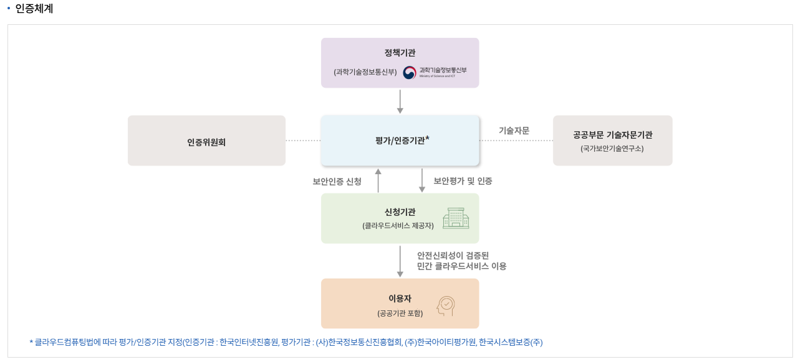
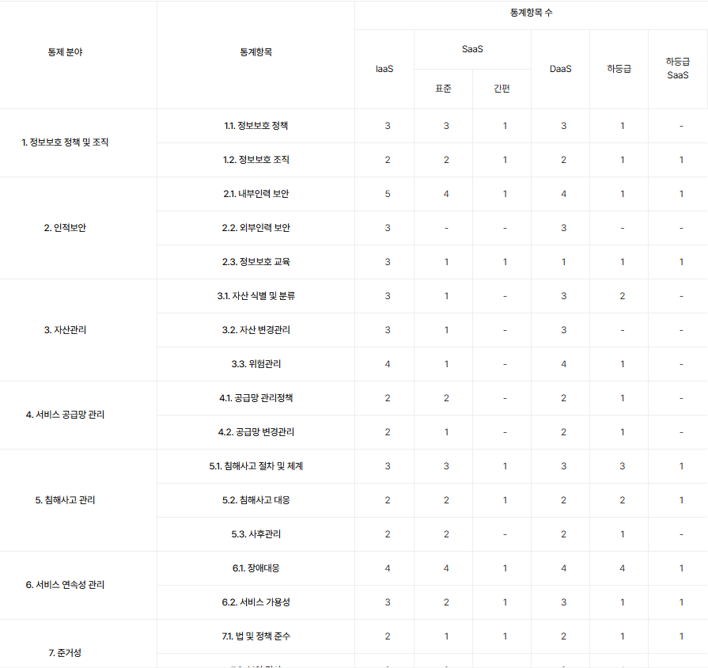
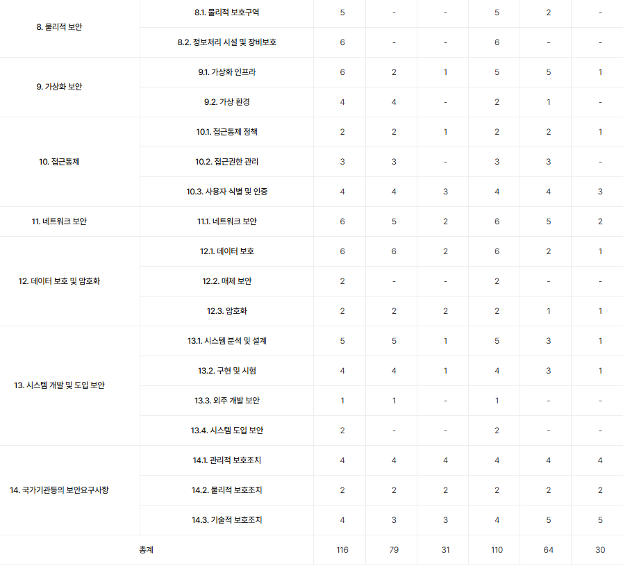
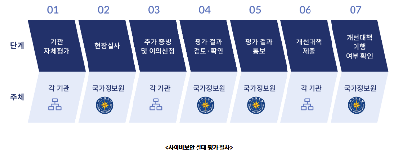
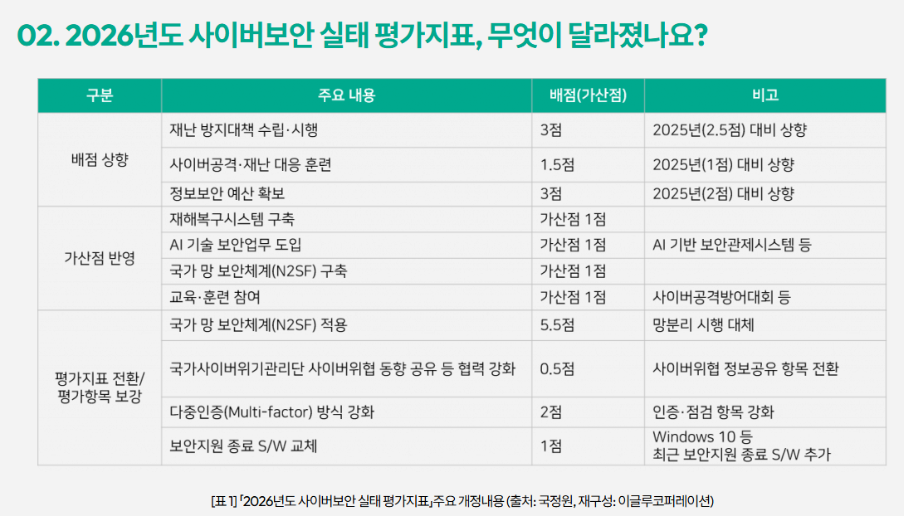

# CSAP 인증제도와 사이버 보안 실태평가 지표

## 목차

1. CSAP 인증제도  
   1.1 개요  
   1.2 CSAP 인증 서비스 유형별 분류  
   1.3 CSAP 인증제도 절차  
   1.4 CASP 인증제도 통제항목  

2. 사이버보안 실태평가  
   2.1 개요  
   2.2 평가 절차  
   2.3 2026년 사이버보안 실태평가지표 주요 변화  

3. 출처  

 

## CSAP 인증제도 

### 개요

CSAP 인증제도는 정보보호 기준의 준수 여부를 인증기관이 평가하고 인증하여, 이용자들이 안심하고 클라우드 서비스를 이용할 수 있도록 지원하는 제도입니다.  

공공기관에 안정성과 신뢰성이 검증된 민간 클라우드 서비스가 공급되며, 이를 통해 공공 영역에서도 안전한 클라우드 도입이 가능해집니다. 공공기관은 민감한 개인정보와 주요 국가 데이터를 처리하기 때문에, 일반적인 상용 서비스보다 높은 수준의 보안이 요구됩니다. 하지만 민간 클라우드 서비스는 사업자마다 보안 수준이 상이하기 때문에, 이를 객관적으로 검증할 수 있는 기준이 필요합니다.  

CSAP 인증은 이러한 문제를 해결하기 위해 도입되었으며, 공공기관이 안전하게 사용할 수 있는 클라우드 서비스를 선별하는 역할을 수행합니다.  

 

### CSAP 인증 서비스 유형별 분류

CSAP 인증은 클라우드 서비스 제공 형태에 따라 평가 기준과 보안 통제 항목이 달라지며, 각 계층별 책임 범위에 따라 인증이 구분됩니다.  

- **IaaS (Infrastructure as a Service)**  
  - 가상 서버, 스토리지, 네트워크 등 인프라 자원을 제공하는 형태입니다.  
  - 사용자는 OS, 애플리케이션, 데이터에 대한 보안을 직접 관리합니다.  
  - CSP는 물리 인프라와 가상화 계층을 보호합니다.  

- **PaaS (Platform as a Service)**  
  - 애플리케이션 개발 및 실행 환경을 제공하는 형태입니다.  
  - 사용자는 애플리케이션과 데이터 중심으로 보안을 관리합니다.  
  - 플랫폼(OS, 미들웨어 등)은 CSP가 관리합니다.  

- **SaaS (Software as a Service)**  
  - 완성된 소프트웨어를 서비스 형태로 제공하는 모델입니다.  
  - 사용자는 서비스 이용과 데이터 관리에 집중합니다.  
  - 애플리케이션 및 인프라 전반은 CSP가 관리합니다.  

- **DaaS (Desktop as a Service)**  
  - 가상 데스크탑 환경을 클라우드 기반으로 제공하는 서비스입니다.  
  - 사용자는 네트워크를 통해 언제 어디서든 동일한 업무 환경에 접근할 수 있습니다.  
  - 디바이스와 물리적 환경에 대한 의존도를 낮추고, 중앙 집중형 보안 통제가 가능합니다.  
  - 제로트러스트 환경에서는 디바이스 신뢰 대신 사용자 신원과 세션 기반 접근 제어와 결합되어 활용됩니다.  

 

### CSAP 인증제도 절차 

   
출처: https://www.kisa.or.kr/1050603

CSAP 인증은 정책기관, 평가기관, 신청기관, 이용자 간의 역할 분리를 기반으로 구성되며, 보안 평가와 인증 과정을 통해 공공에서 신뢰할 수 있는 클라우드 서비스를 선별하는 구조입니다.  

1. 클라우드 서비스 제공자가 인증을 신청합니다.  
2. 평가/인증기관이 보안 평가를 수행합니다.  
3. 필요 시 기술자문기관의 지원을 받아 평가의 신뢰성을 확보합니다.  
4. 평가 결과를 기반으로 인증이 부여됩니다.  
5. 공공기관은 인증된 클라우드 서비스를 이용합니다.  

 

## CASP 인증제도 통제항목

CASP 통제항목의 자세한 표는 다음과 같습니다.  
 

  
   
출처: https://isms-p.or.kr/sysm/intro/selectSysmVrtlDetail.do

 

## 사이버보안 실태평가

### 개요

출처: https://www.ncsc.go.kr:4018/PageLink.do?link=forward:/PageContent.do&tempParam1=&menuNo=010000&subMenuNo=010200&thirdMenuNo=010202

사이버보안 실태평가는 기관의 정보보호 수준을 점검하고, 취약점을 식별하여 전반적인 보안 수준을 향상시키기 위한 평가 제도입니다. 각 기관이 자체적으로 보안 상태를 점검한 이후, 국가정보원이 이를 검증하고 보완하는 단계적 구조로 운영됩니다.  

사이버보안 실태평가는 다음과 같은 단계로 진행됩니다.

1. **기관 자체평가**  
   - 각 기관이 내부 보안 통제 수준을 점검하고 자체적으로 평가를 수행합니다.  

2. **현장실사 (국가정보원)**  
   - 국가정보원이 직접 현장을 점검하여 실제 보안 수준을 검증합니다.  

3. **추가 증빙 및 이의신청**  
   - 기관은 평가 결과에 대한 추가 자료를 제출하거나 이의를 제기할 수 있습니다.  

4. **평가 결과 검토·확인 (국가정보원)**  
   - 제출된 자료를 기반으로 최종 평가 내용을 검토하고 확정합니다.  

5. **평가 결과 통보 (국가정보원)**  
   - 확정된 평가 결과를 기관에 공식 통보합니다.  

6. **개선대책 제출**  
   - 기관은 식별된 취약점에 대한 개선 계획을 수립하여 제출합니다.  

7. **개선대책 이행 여부 확인 (국가정보원)**  
   - 국가정보원이 개선 조치 이행 여부를 확인하고 후속 관리합니다.  

 

### 2026년 사이버보안 실태평가지표 주요 변화

[출처: igloo 2026년도 사이버보안 실태 평가지표’ 개정 내용으로 본 공공 보안 정책의 변화](https://www.igloo.co.kr/security-information/%EB%B3%B4%EC%95%88-101-%E3%80%8C2026%EB%85%84%EB%8F%84-%EC%82%AC%EC%9D%B4%EB%B2%84%EB%B3%B4%EC%95%88-%EC%8B%A4%ED%83%9C-%ED%8F%89%EA%B0%80%EC%A7%80%ED%91%9C%E3%80%8D-%EC%A3%BC%EC%9A%94-%EA%B0%9C/)  

2025년에는 다음과 같은 항목이 존재했습니다. 
- `내부망과 인터넷을 분리하였는가? 1점`
- `망분리 위반사항에 대해 주기적으로 점검하는가? 2점`
- `승인없는 자료 반출입이 불가토록 망간 자료전송 시스템 등 망분리 시스템을 운영하고 있는가? 2점`

이와 비교해보았을 때, 기존 망 분리 중심 보안에서 N2SF 기반 제로트러스트 구조로 전환되는 흐름임을 알 수 있습니다. 

현재의 평가 기준은 대부분 형식적인 실제 보안 운영 능력 중심입니다.  \
재난 대응, 복구 체계, 보안 훈련 항목의 배점이 증가한 이유는 사고 대응 역량을 직접 평가하기 위함입니다. AI의 발전에 따라 AI 기반 보안 기술과 자동화된 운영 체계도 주요 평가 요소가 되었습니다. 대규모 환경에서 수동 대응이 아닌 자동화 기반 보안 운영이 필수이며, 다중인증과 같은 인증 강화 항목은 신원 기반 통제를 강화하기 위한 요소입니다.

2026년 사이버보안 실태평가는 기존처럼 정적인 보안 구조가 아니라, 지속적으로 검증되고 운영되는 동적인 보안 체계를 요구하는 방향입니다. 

 
 

## 출처

- https://www.kisa.or.kr/1050603
- https://isms-p.or.kr/sysm/intro/selectSysmVrtlDetail.do
- https://www.ncsc.go.kr:4018/PageLink.do?link=forward:/PageContent.do&tempParam1=&menuNo=010000&subMenuNo=010200&thirdMenuNo=010202
- https://www.igloo.co.kr/security-information/%EB%B3%B4%EC%95%88-101-%E3%80%8C2026%EB%85%84%EB%8F%84-%EC%82%AC%EC%9D%B4%EB%B2%84%EB%B3%B4%EC%95%88-%EC%8B%A4%ED%83%9C-%ED%8F%89%EA%B0%80%EC%A7%80%ED%91%9C%E3%80%8D-%EC%A3%BC%EC%9A%94-%EA%B0%9C/
