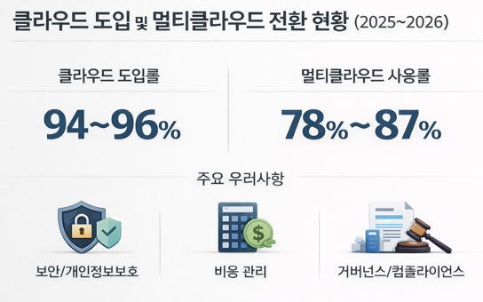

# 클라우드 보안사고 트렌드

## 목차

 

## 클라우드 보안 사고

### 개요 

  

- 클라우드 도입률: 94~96% (Softjourn, 2026)
- 멀티클라우드 사용률: 78% ~ 87%

조사 결과가 범위로 나오는 이유는 조사 기관과 기준에 따라 차이가 존재하기 때문입니다. 기본적인 범위는 다음 링크를 참고하였습니다.  

> 링크 : https://sqmagazine.co.uk/cloud-adoption-statistics/#:~:text=55%25%20of%20organizations%20are%20now,%2C%20a%209%25%20YoY%20increase.

대부분의 기업은 클라우드를 도입한 상태이며, 그 중 상당수는 멀티클라우드 환경으로 전환한 상태입니다. 특정 벤더에 대한 종속을 줄이기 위한 전략으로, 예를 들어 핵심 서비스는 AWS에서 운영하면서 데이터 분석이나 AI 워크로드는 GCP를 활용하는 방식으로 구성할 수 있습니다. 이러한 구조는 서비스 장애 발생 시 다른 클라우드로 트래픽을 분산하거나 백업 시스템을 활용할 수 있어 안정성을 높이며, 동시에 각 클라우드의 강점을 선택적으로 활용할 수 있어 유연성 또한 확보할 수 있습니다.

그러나 이러한 전환과 확산에 따라 보안 및 개인정보보호 이슈가 주요 우려사항으로 부각되고 있으며, 동시에 클라우드 비용 증가와 관리 복잡성 또한 중요한 우려사항으로 나타나고 있습니다. 멀티클라우드 환경에서는 각 클라우드별 정책과 규제를 통합적으로 관리해야 하기 때문에 거버넌스/컴플라이언스 측면에서도 높은 수준의 관리 체계가 요구됩니다.

 

### 클라우드 보안 사고 근본 원인 top 5

- #### 1. Misconfiguration / 설정 오류

클라우드 보안 사고의 가장 대표적인 근본 원인은 잘못된 설정입니다.  
공개되면 안 되는 스토리지 버킷이 외부에 노출되거나, 사용자 정의 방화벽 규칙이 과도하게 열려 있거나, 변경 통제가 제대로 이루어지지 않아 권한과 네트워크 설정이 의도와 다르게 확장되는 경우가 이에 해당합니다. CSA는 2024년 Top Threats에서 **Misconfiguration and inadequate change control**를 가장 먼저 제시했으며, Google Cloud도 최근 위협 동향에서 사용자가 관리하는 소프트웨어와 허용적인 사용자 정의 방화벽 규칙이 실제 초기 침투 경로로 악용된다고 설명합니다. 실제 사고 사례에서는 클라우드 자체보다도 잘못 구성된 고객 환경에서 시작되는 경우가 많습니다.

- #### 2. Identity and Access Management / IAM 관리 실패 (권한 설정 오류)

두 번째 근본 원인은 인증과 권한 관리 실패입니다. 과도한 권한 부여, MFA 미적용, 페더레이션 계정 통제 미흡, 토큰 탈취, 공유 계정 사용 같은 문제가 여기에 포함됩니다. CSA는 Identity and Access Management를 독립적인 핵심 위협으로 제시했고, Google Cloud Threat Horizons H1 2026은 침해의 83%가 identity compromise를 기반으로 했다고 명시합니다. 또한 Google은 피싱을 넘어 음성 기반 사회공학, 토큰 탈취, 다중 클라우드와 SaaS를 아우르는 인증 경계 공격이 확대되고 있다고 설명합니다.

- #### 3. 계정정보 도난 (Credential Theft)

클라우드 환경에서는 계정이 곧 시스템 접근 권한을 의미합니다. 따라서 계정 정보가 탈취되는 순간 공격자는 별도의 취약점 없이도 내부 자원에 접근할 수 있게 됩니다. 특히 피싱과 같은 사회공학 공격으로 인한 계정 탈취가 매우 흔해졌으며, 치명적인 초기 침투 경로가 생기게 됩니다. 추가로 토큰 탈취와 같은 자격 증명이 유출되게 된다면, 클라우드같은 경우에는 콘솔과 API와 CLI 접근이 모두 계정을 통해 이루어지기 때문에 피해 범위가 빠르게 확장됩니다. 실제로 최근 클라우드 침해 사고의 상당수는 인프라 취약점이 아닌 계정 탈취에서 시작되는 것으로 나타나고 있습니다.

- #### 4. SSH 키 유출 및 오용

SSH 키는 서버와 인스턴스 접근을 위한 핵심 인증 수단이지만, 관리가 미흡할 경우 공격자가 직접 서버에 접근할 수 있는 통로가 됩니다. 개인 PC, 코드 저장소, CI/CD 환경 등에 저장된 키가 유출되거나, 재사용된 키가 여러 시스템에 적용된 경우 공격 범위가 크게 확대됩니다. 또한 키에 대한 회전정책과 폐기 정책이 없을 경우, 장기간 무단 접근이 지속될 수 있어 심각한 보안 위협으로 이어집니다.

- #### 5. 접근 통제 실패 (Access Control Failure)

클라우드에서는 세밀한 권한 관리가 가능하지만, 실제 운영에서는 과도한 권한 부여(Over-privilege)가 빈번하게 발생합니다. 관리자 권한을 불필요하게 부여하거나, 역할 기반 접근 제어(RBAC)가 제대로 설계되지 않은 경우 공격자는 하나의 계정만 확보해도 전체 시스템을 제어할 수 있습니다. 특히 멀티클라우드 환경에서는 권한 정책이 분산되어 관리되기 때문에, 일관되지 않은 접근 통제가 보안 취약점으로 이어질 가능성이 높습니다.

- #### 추가 관점: 탐지 실패로 인한 영향 심화

위와 같은 문제들이 발생한다면, 적절한 탐지 체계를 갖춰야합니다. 그러지 않을 경우 피해가 더욱 확대됩니다. 로그 수집은 되어 있으나 실시간 분석이 이루어지지 않거나, 이상 행위 탐지 체계가 부재한 경우 공격자는 장기간 시스템에 머무르며 권한을 확장하고 데이터를 유출할 수 있습니다. 탐지 실패는 피해 규모를 증폭시키는 주요 원인이 됩니다. 

 

## 통합 대응 전략

클라우드 보안 사고의 주요 원인은 설정 오류, 권한 관리 실패, 인증 취약점, 그리고 탐지 부족에서 비롯됩니다.  

이에 따라 구성 관리, 권한 통제, 인증, 모니터링을 통합적으로 적용하는 전략이 필요합니다. 이러한 통합 대응 전략은 예방과 탐지를 동시에 강화하여 클라우드 환경 전반의 보안 수준을 향상시켜야합니다.  
 

### 구성 관리 및 권한 통제 강화

클라우드 환경에서는 설정과 권한을 코드 기반으로 관리하고 최소 권한 원칙을 적용하는 것이 중요합니다.  

- **IaC (Infrastructure as Code)**  
인프라를 코드로 정의하고 관리하여, 설정 변경을 추적 가능하게 만들고 휴먼 에러를 최소화합니다. 코드 리뷰와 CI/CD 파이프라인을 통해 보안 정책을 사전에 검증할 수 있습니다.

- **CSPM (Cloud Security Posture Management)**  
클라우드 리소스의 설정 상태를 지속적으로 점검하여, 공개 스토리지, 과도한 포트 개방, 정책 위반 등 보안 설정 오류를 자동으로 탐지하고 수정합니다.

- **Least Privilege (최소 권한 원칙)**  
사용자 및 서비스 계정에 필요한 최소한의 권한만 부여하여, 계정 탈취 시 피해 범위를 제한합니다. 권한 사용 패턴을 기반으로 지속적인 권한 축소가 필요합니다.
 

### 강력한 인증 및 지능형 모니터링

계정 탈취와 탐지 실패를 방지하기 위해서는 인증 체계를 강화하고, 로그 기반의 실시간 분석 체계를 구축해야 합니다.

- **MFA (Multi-Factor Authentication)**  
단일 인증 요소에 의존하지 않고 추가 인증 수단을 적용하여 계정 탈취 위험을 크게 낮춥니다. 특히 관리자 계정과 외부 접근 경로에는 필수적으로 적용해야 합니다.

- **로그 중앙화 (Centralized Logging)**  
여러 클라우드와 서비스에서 발생하는 로그를 중앙에서 수집/관리하여, 전체 시스템의 가시성을 확보합니다. 이를 통해 이상 행위 탐지와 사고 대응 속도를 향상시킬 수 있습니다.

- **지능형 위협 탐지 (Intelligent Threat Detection)**  
AI 분석 기능을 활용한 SIEM(Security Information and Event Management) 또는 SOAR(Security Orchestration, Automation and Response)를 통해 로그를 실시간으로 분석하고, 이상 행위를 탐지합니다. 단순 이벤트 탐지를 넘어 공격 패턴을 상관 분석하고 자동 대응까지 수행함으로써, 초기 침투 단계에서 위협을 식별하고 대응 속도를 크게 향상시킬 수 있습니다.

 

## 

 
 

## 출처

- 