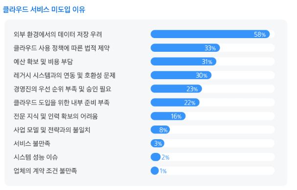
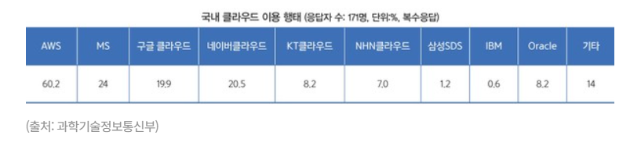
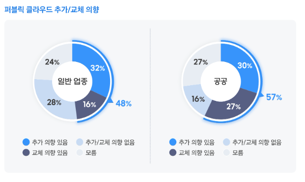
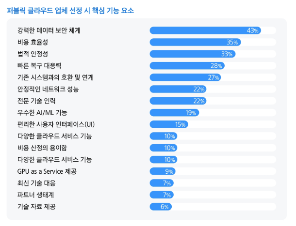

# 국내 CSP 현황과 해외 CSP 현활 비교 분석  

## 목차

1. 국내 클라우드  
   1.1 개요  
   1.2 공공 클라우드 도입 특징 및 제약 요인  
   1.3 국내 클라우드 시장 점유율  
   1.4 클라우드 시장 변화 가능성  
   1.5 CSP 선택 기준과 향후 경쟁 전략  

2. 국내 CSP 보안 차별성 및 개선 과제  
   2.1 국내 CSP 보안 강점  
   2.2 해외 CSP 대비 한계점  

3. 결론  

4. 출처  

 

## 국내 클라우드

### 개요  

국내 클라우드 시장은 공공과 민간을 중심으로 점진적으로 성장하고 있으며, 특히 공공 부문에서의 도입 확대가 주요한 특징으로 나타납니다.  

그 이유는 시장을 분석할 때 공공 부문이 시장의 방향성과 보안 기준을 결정하는 핵심 영역으로 작용하기 때문입니다. 더 자세한 이유로, CSAP과 같은 보안 인증과 규제를 필수적으로 요구하며, 해당 기준을 충족해야만 서비스 제공이 가능하기 때문입니다. 공공 시장은 CSP에게 기술력과 보안 수준을 검증받는 중요한 레퍼런스 역할을 수행하고 공공 환경에서 요구되는 높은 수준의 보안, 감사, 접근 통제 요건을 충족해야 이후 민간 시장에서도 신뢰를 확보할 수 있기 때문입니다.  

결과적으로 국내 클라우드 시장은 기술 중심으로 빠르게 확장된 해외 시장과 달리, 규제와 보안 기준을 기반으로 점진적으로 성장하는 특징을 가지고 있으며, 이러한 차이는 이후 국내 CSP와 해외 CSP를 비교 분석하는 데 있어 중요한 기준으로 작용합니다.

 

### 공공 클라우드 도입 특징 및 제약 요인

     
출처: 삼성 SDS 2025 국내 퍼블릭 클라우드 현황 보고서  

국내 공공 클라우드 도입률은 약 45% 수준으로, 민간(약 70%)과 해외 대비 낮은 수준을 보이고 있습니다. 이러한 차이는 공공기관이 다루는 데이터의 민감성과 높은 보안 요구사항으로 추정됩니다. 삼성 SDS의 퍼블릭 클라우드 현황보고서에 따르면 이러한 이유는, 외부 데이터 저장의 우려와 법적 제약이 가장 높은 이유였습니다. 이를 통해, 보안에 대한 높은 요구 수준과 법적 규제 준수가 필요한 공공기관의 특성이 클라우드 도입의 중요한 고려사항으로 보입니다.  

또한 한 가지 흥미로운 점은, 공공 부문에서 멀티클라우드를 도입하는 주요 이유로 운영 비용 최적화가 1위로 나타났다는 점입니다. 이는 해외나 민간 기업이 멀티클라우드를 선택할 때 가용성 확보, 서비스 확장성, 기술적 유연성 등 혁신 중심의 목적을 가지는 것과는 다른 양상입니다.

공공 환경에서는 예산이 제한되어 있기 때문에, 특정 CSP에 대한 의존도를 낮추고 비용 효율적인 자원을 선택적으로 활용하는 전략이 더 중요하게 작용합니다. 즉, 멀티클라우드가 기술적 최적화 수단이기보다는 비용 절감을 위한 운영 전략으로 활용되는 경향이 강합니다.

이러한 차이는 국내 공공 클라우드가 기술 중심이 아닌 정책과 예산 중심으로 운영되고 있음을 보여주며, 해외 클라우드 시장과의 구조적 차이를 더욱 명확하게 드러내는 요소로 볼 수 있습니다.

 

### 국내 클라우드 시장 점유율

국내 클라우드 시장은 AWS가 약 60%로 매우 높은 이용 비율을 보이며 시장을 주도하는 구조를 나타냅니다.   

다만, 이를 완전한 독점 구조로 보기는 어렵습니다. Google Cloud, Microsoft Azure, 네이버클라우드 등 일부 CSP가 일정 수준 이상의 점유율을 확보하며 추격 구도를 형성하고 있기 때문입니다.

결과적으로 국내 클라우드 시장은 AWS를 중심으로 소수의 CSP가 경쟁하는 과점 구조와 그 외 사업자가 존재하는 형태로 볼 수 있습니다. 특히 상위 CSP와 하위 CSP 간 점유율 격차가 크다는 점에서, 시장 내 경쟁이 균등하게 이루어지고 있다기보다는 특정 사업자 중심으로 집중된 구조적 특징을 가진다고 해석할 수 있습니다.  

 

### 클라우드 시장 변화 가능성

  
출처: 삼성 SDS 2025 국내 퍼블릭 클라우드 현황 보고서  

이러한 시장 구조에도 불구하고, 퍼블릭 클라우드에 대한 추가 도입 및 교체 의향이 지속적으로 존재한다는 점은 주목할 필요가 있습니다. 

자료에 따르면 일반 산업군의 경우 약 48%, 공공 부문에서는 약 57%가 추가 도입 또는 교체 의향을 보이고 있으며, 이는 현재의 시장 점유율 구조가 고정된 것이 아니라 향후 변화 가능성이 충분히 존재함을 의미합니다. 특히 공공 부문에서 더 높은 수치를 보인다는 점은, 기존의 보수적인 도입 기조에도 불구하고 클라우드 전환이 점진적으로 확대되고 있음을 시사합니다. 이는 충분히 후발 CSP가 점유율을 확대할 수 있는 기회가 존재한다고 판단 가능합니다.  

 

### CSP 선택 기준과 향후 경쟁 전략

  
출처: 삼성 SDS 2025 국내 퍼블릭 클라우드 현황 보고서  

한편, 클라우드 사업자 선택 시 고려 요소를 살펴보면, 데이터 보안 체계(43%), 비용 효율성(35%), 법적 안정성(33%)이 상위 요소로 나타났습니다. 이는 특히 국내 환경에서 보안과 규제가 여전히 가장 중요한 의사결정 기준으로 작용하고 있음을 보여줍니다.  

이러한 점을 종합하면, 국내 CSP가 향후 경쟁력을 확보하기 위해서는 단순한 인프라 제공을 넘어 다음과 같은 방향으로 전략을 수립할 필요가 있습니다.

- **보안 및 컴플라이언스 역량 강화**  
CSAP, 데이터 주권, 감사 대응 등 공공 및 규제 환경에서 요구되는 수준을 만족시키는 것이 필수적이며, 이는 국내 CSP가 글로벌 CSP 대비 차별화할 수 있는 핵심 영역입니다.

- **비용 효율적인 운영 구조**  
공공 및 국내 기업은 비용에 민감하기 때문에, 운영 비용(TCO)을 낮출 수 있는 구조와 서비스 제공이 중요합니다.

- **기존 시스템과의 호환성 및 연계성 확보**  
온프레미스 및 레거시 시스템과의 연동은 국내 시장에서 중요한 요소이며, 이를 지원하는 하이브리드/멀티클라우드 전략이 필요합니다.

- **AI 및 고급 서비스 역량 확대**   
현재는 보안과 비용이 주요 선택 기준이지만, 장기적으로는 AI/데이터 기반 서비스 경쟁으로 확장될 가능성이 높기 때문에 이에 대한 선제적 대응이 필요합니다.

요약하자면, 국내 클라우드 시장은 현재 AWS 중심의 과점 구조를 보이지만, 추가 도입 및 교체 수요를 기반으로 점진적인 경쟁 심화와 구조 변화가 예상되는 시장이며, 국내 CSP는 보안, 비용, 규제 대응 역량을 중심으로 차별화 전략을 구축해야 할 필요가 있습니다.  

 

## 국내 CSP 보안 차별성 및 개선 과제

### 국내 CSP 보안 강점

| CSP         | 주요 보안 강점                                                     |
| ----------- | ------------------------------------------------------------ |
| NAVER Cloud | CSAP 레퍼런스 기반 공공 시장 경쟁력, 24/365 보안 관제 체계, 공공 SaaS 및 인증 컨설팅 지원 |
| Kakao Cloud | 제로트러스트 기반 설계, 키 관리 서비스 및 내부 보안 구조 강화, SmartNIC 기반 하드웨어 오프로딩  |
| NHN Cloud   | 자체 SOC 운영, CSAP 및 ISMS-P 인증 확보, 공공/금융 특화 보안 역량               |
| KT Cloud    | CSAP(IaaS) 인증 및 공공시장 1위, 24/365 보안관제 서비스 제공                  |

 

국내 CSP는 전반적으로 공공 및 규제 대응 중심의 보안 체계를 갖추고 있으며, CSAP 인증을 기반으로 한 신뢰성과 운영 안정성이 주요 강점으로 나타납니다. 특히 보안 관제(SOC), 인증 체계, 데이터 보호 측면에서는 일정 수준 이상의 성숙도를 확보하고 있습니다.

또한 공공 및 금융 환경에서 요구되는 보안 요건을 충족하기 위해, 접근 통제, 감사 로그, 인증 관리 등 컴플라이언스 중심 보안이 강화된 구조를 보입니다.

그러나 이러한 구조는 규제 대응에는 강점을 가지지만, 클라우드 네이티브 보안 영역에서는 상대적으로 한계를 가지는 특징이 있습니다. 이는 국내 CSP가 CSAP, ISMS-P 등 인증 기반 보안 요구사항을 충족하는 데 집중하면서, 컨테이너, 마이크로서비스, 서버리스 환경에서 요구되는 런타임 중심의 동적 보안 기술 적용이 상대적으로 제한적이기 때문입니다.

또한 서비스별로 로그와 보안 기능이 분산된 구조를 가지는 경우가 많아, 멀티클라우드 및 분산 환경에서 요구되는 통합 가시성과 중앙화된 보안 분석 체계(SIEM, SOAR 연계)가 부족한 측면이 있습니다.

더불어 IaC(Infrastructure as Code) 기반의 보안 정책 자동화나 DevSecOps 파이프라인과의 연계 수준이 글로벌 CSP 대비 낮아, Shift Left 보안 적용이 제한되는 경향을 보입니다.

이와 같은 이유로 국내 CSP는 전통적인 보안 통제와 컴플라이언스 대응에는 강점을 가지지만, 클라우드 네이티브 환경에서 요구되는 실시간 탐지, 자동화, 통합 보안 운영 측면에서는 개선이 필요한 것으로 이해됩니다.  

 

### 해외 CSP 대비 한계점

해외 CSP(AWS, GCP, Azure)는 클라우드 네이티브 환경을 전제로 설계된 보안 서비스를 제공하는 반면, 국내 CSP는 공공 및 규제 대응 중심으로 발전해왔기 때문에 다음과 같은 한계가 존재합니다.

- #### 런타임 보안 제한

국내 CSP는 컨테이너 및 워크로드 실행 시점의 위협을 탐지하는 기능이 제한적인 경우가 많습니다.  
AWS GuardDuty, GCP Security Command Center, Azure Defender와 같이 런타임 기반 이상 행위 탐지 및 행위 분석 기능이 기본 서비스로 통합되어 있는 것과 달리, 국내 CSP는 주로 네트워크 및 접근 통제 중심의 보안 기능에 집중되어 있습니다.  

또한 eBPF 기반 행위 탐지, 컨테이너 런타임 보호, Kubernetes 보안 정책 자동 적용 등의 기능이 제한적이거나 별도 구성에 의존하는 경우가 많아, 실시간 공격 대응 능력에서 차이가 발생합니다.

- #### 3.2 로그 통합 및 가시성 부족

해외 CSP는 CloudWatch, Cloud Logging, Azure Monitor와 같이 로그 수집, 저장, 분석이 통합된 플랫폼을 제공하며, 이를 기반으로 SIEM 연계 및 중앙 분석이 가능합니다.  

반면 국내 CSP는 서비스별 로그가 분산되어 있거나, 통합 로그 분석 플랫폼이 제한적인 경우가 많아 멀티클라우드 및 분산 환경에서 전체 공격 흐름을 추적하는 데 어려움이 있습니다.  

특히 보안 이벤트를 하나의 타임라인으로 상관 분석하는 기능이 부족하여, 복합 공격 시나리오 대응에 한계가 발생할 수 있습니다.

- #### 3.3 위협 탐지 및 대응 자동화 부족

해외 CSP는 AI/ML 기반 이상 탐지(UEBA), 위협 인텔리전스 연계, SOAR 기반 자동 대응 기능을 기본적으로 제공하거나 쉽게 연계할 수 있는 구조를 가지고 있습니다.  

예를 들어, AWS는 GuardDuty + Security Hub + Lambda를 통해 자동 대응을 구성할 수 있으며, Azure는 Sentinel 기반의 SOAR 기능을 제공합니다.  

반면 국내 CSP는 탐지 이후 대응을 수동으로 처리하는 경우가 많고, 자동화된 대응 플레이북이나 정책 기반 차단 기능이 제한적이기 때문에 대응 속도와 운영 효율성 측면에서 차이가 발생합니다.

- #### 3.4 IaC 기반 보안 자동화 미흡

해외 CSP는 Terraform, CloudFormation, ARM Template 등 IaC와 보안 정책을 긴밀하게 통합하여, 인프라 생성 단계에서부터 보안이 적용되는 구조를 제공합니다.  

또한 CSPM(Cloud Security Posture Management), CIEM(Cloud Infrastructure Entitlement Management) 기능이 통합되어 있어, 설정 오류나 과도한 권한을 자동으로 탐지하고 수정할 수 있습니다.  

반면 국내 CSP는 IaC 기반 보안 정책 자동화 지원이 상대적으로 부족하며, DevSecOps 파이프라인과의 연계도 제한적인 경우가 많아 보안이 사후적으로 적용되는 구조가 나타납니다.  

이로 인해 보안 설정 오류나 권한 관리 문제를 사전에 방지하기보다는, 운영 이후에 대응하는 방식이 되는 한계가 존재합니다.

 

## 결론 

국내 클라우드 시장은 AWS 중심의 과점 구조 속에서 공공 및 규제 환경을 기반으로 성장해왔으며, 보안 측면에서는 CSAP, ISMS-P 등 인증 기반의 컴플라이언스 대응 역량에서 강점을 보이고 있습니다.    

그러나 해외 CSP와 비교할 때, 클라우드 네이티브 환경에서 요구되는 런타임 보안, 통합 로그 가시성, 위협 탐지 자동화, IaC 기반 보안 자동화 측면에서는 상대적인 한계가 존재합니다. 이는 국내 CSP가 규제 대응 중심으로 발전해온 구조적 특성에서 기인한 것으로 볼 수 있습니다.  

한편, 퍼블릭 클라우드의 추가 도입 및 교체 의향이 지속적으로 증가하고 있다는 점은 시장이 고정되어 있지 않으며, 향후 경쟁 구조 변화 가능성이 존재함을 의미합니다.  

따라서 국내 CSP는 클라우드 네이티브 환경에 적합한 자동화된 보안 체계와 통합 운영 플랫폼으로의 전환이 필요하며, 이를 통해 글로벌 CSP와의 기술 격차를 줄이고 경쟁력을 확보해야 할 것입니다.  

결론은, 향후 클라우드 보안 경쟁력을 올리기 위해서 규제 대응에 더불어 실시간 탐지, 자동 대응, DevSecOps 기반 보안 자동화 역량을 올릴 수 있느냐에 의해 결정될 것으로 판단합니다.

 
 

## 출처 

- https://www.msit.go.kr/eng/bbs/view.do?sCode=eng&nttSeqNo=993&pageIndex=&searchTxt=&searchOpt=ALL&bbsSeqNo=42&mId=4&mPid=2#:~:text=Korean%20companies%20have%20shown%20outstanding,digital%20technologies%20across%20various%20industries.
- https://www.samsungsds.com/kr/insights/2025-domestic-public-cloud-service-status-public-sector.html
- https://fun-it-s.tistory.com/entry/2024%EB%85%84-1%EB%B6%84%EA%B8%B0-%ED%95%9C%EA%B5%AD-%ED%81%B4%EB%9D%BC%EC%9A%B0%EB%93%9C-%EC%8B%9C%EC%9E%A5-%EB%8F%99%ED%96%A5-%EB%B0%8F-%EC%B5%9C%EA%B7%BC-%EC%84%B1%EA%B3%BC-%EB%B6%84%EC%84%9D
- https://www.comworld.co.kr/news/articleView.html?idxno=51575